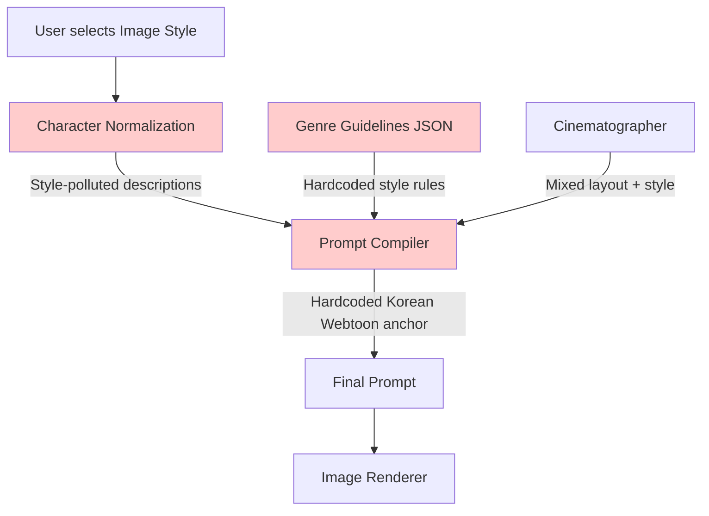
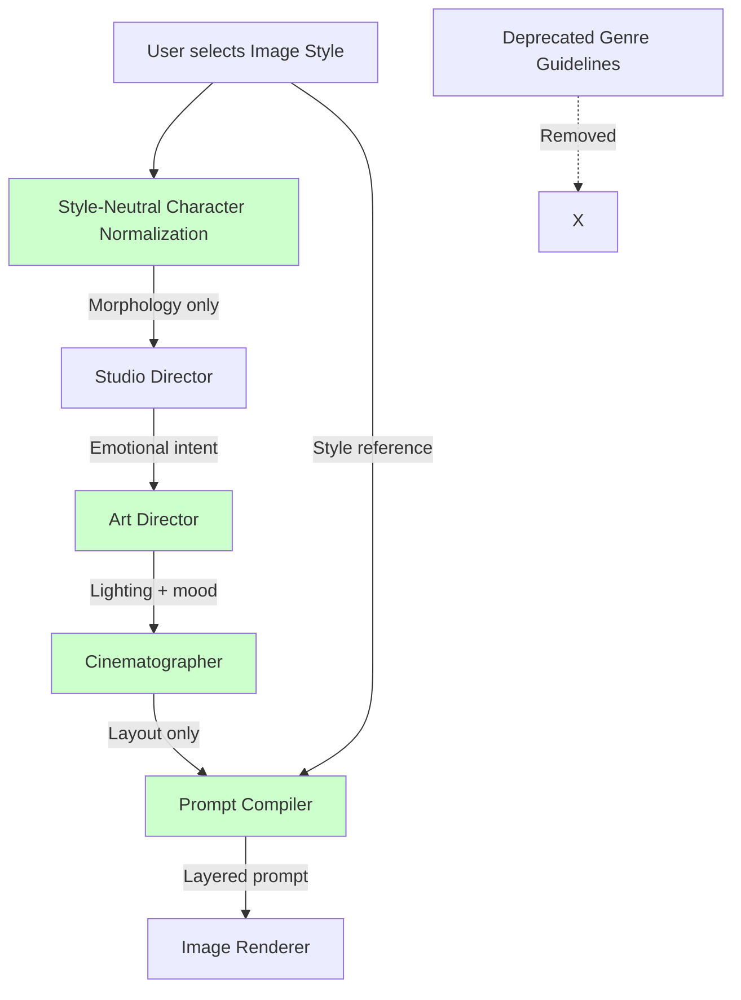

# Design Document: Visual Responsibility Split

## Overview

This design implements a comprehensive refactoring of the webtoon generation system's visual pipeline to eliminate style overwriting and establish clear separation of concerns between layout (cinematography), mood (art direction), and rendering style (image style).

The current system suffers from a "vertical overwriting" problem where user-selected `image_style` parameters are systematically overridden by:
1. Style-polluted character descriptions stored in the database
2. Hardcoded "Korean Webtoon/Manhwa" anchors in prompt compilation
3. Muddled responsibility between genre guidelines (mixing "what" and "how")

This design introduces:
- **Style-neutral character normalization** that focuses on morphology only
- **Hardcoded anchor removal** from all prompt-related code
- **Genre guidelines deprecation** in favor of high-level reasoning
- **Cinematographer responsibility decoupling** to focus on layout only
- **Art Director node** to handle mood and atmosphere
- **Prompt layering hierarchy** to ensure style precedence

## Architecture

### Current Architecture (Problematic)



**Problems:**
- Character descriptions contain "manhwa aesthetic", "flower-boy" keywords
- Genre guidelines mix structural (layout) and stylistic (rendering) concerns
- Prompt compiler adds hardcoded "Korean webtoon/manhwa art style" regardless of user choice
- Cinematographer generates color/lighting keywords that conflict with image style
- No clear priority order - later sections can override earlier style declarations

### New Architecture (Solution)



**Solutions:**
- Character normalization produces style-agnostic morphological descriptions
- Studio Director provides high-level emotional intent without style directives
- Art Director translates intent to lighting/mood compatible with image style
- Cinematographer focuses solely on camera, angle, composition
- Prompt Compiler layers prompts with clear precedence: Style → Mood → Layout → Morphology

## Components and Interfaces

### 1. Character Normalization (Modified)

**Location:** `app/prompts/v1/story_build/character_normalization.yaml`

**Current Behavior:**
- Generates descriptions with "Korean manhwa aesthetic", "flower-boy", "webtoon romance female lead"
- Stores style-polluted `identity_line` in database
- Injects style keywords into every scene prompt

**New Behavior:**
- Generates morphological descriptions only (hair color/length, facial structure, body proportions)
- Excludes all stylistic keywords
- Focuses on objective physical attributes

**Interface Changes:**

```python
# Before (style-polluted)
{
    "identity_line": "early_20s Korean female, long flowing black hair with soft waves, "
                    "large expressive doe eyes with delicate lashes, tall statuesque figure 168cm, "
                    "cream knit sweater and high-waisted jeans, "
                    "authentic webtoon romance female lead aesthetic"  # ← Style pollution
}

# After (style-neutral)
{
    "identity_line": "early_20s East Asian female, long straight black hair reaching mid-back, "
                    "almond-shaped eyes with double eyelids, slender build 168cm with balanced proportions, "
                    "cream knit sweater and high-waisted jeans"  # ← No style keywords
}
```

**Prompt Template Changes:**

```yaml
# Remove these sections:
# - "Apply Korean manhwa aesthetic standards"
# - "AGE-BASED VISUAL STANDARDS (Korean Manhwa Style)"
# - "authentic webtoon romance female lead aesthetic"

# Replace with:
# - "Provide objective morphological descriptions"
# - "AGE-BASED PHYSICAL STANDARDS (Style-Agnostic)"
# - "Focus on measurable physical attributes"
```

### 2. Prompt Compiler (Refactored)

**Location:** `app/graphs/nodes/prompts/compile.py`

**Current Behavior:**
- Hardcodes "Korean webtoon/manhwa art style (Naver webtoon quality)"
- Hardcodes "Vertical 9:16 webtoon/manhwa image"
- No clear layering hierarchy

**New Behavior:**
- Uses dynamic image style reference from user selection
- Removes all hardcoded style anchors
- Implements clear prompt layering hierarchy

**Function Signature:**

```python
def _compile_prompt(
    panel_semantics: dict,
    layout_template: dict,
    style_id: str,
    art_direction: dict,  # NEW: Art Director output
    characters: list[Character],
    reference_char_ids: set[uuid.UUID] | None = None,
    variants_by_character: dict[tuple[uuid.UUID, str], CharacterVariant] | dict[uuid.UUID, CharacterVariant] | None = None,
) -> str:
    """Compile a production-grade image generation prompt with clear layering hierarchy."""
```

**Prompt Structure:**

```python
lines = [
    # LAYER 1: Image Style (Highest Priority)
    "**IMAGE STYLE:**",
    f"- {style_description}",  # From IMAGE_STYLE_PROFILES[style_id]
    "",
    
    # LAYER 2: Art Direction (Mood & Atmosphere)
    "**ART DIRECTION:**",
    f"- Lighting: {art_direction['lighting']}",
    f"- Color Temperature: {art_direction['color_temperature']}",
    f"- Atmosphere: {', '.join(art_direction['atmosphere_keywords'])}",
    "",
    
    # LAYER 3: Format & Composition
    "**ASPECT RATIO & FORMAT:**",
    "- CRITICAL: Vertical 9:16 format for vertical scrolling",  # No style reference
    "",
    
    # LAYER 4: Reference Image Authority
    "**REFERENCE IMAGE AUTHORITY:**",
    "- Character reference images are PRIMARY source of facial identity",
    "- Text descriptions for role, action, emotion, clothing ONLY",
    "",
    
    # LAYER 5: Panel Composition (Cinematographer)
    "**PANEL COMPOSITION:**",
    f"- Layout: {layout_text}",
    f"- Panel count: {panel_count}",
    # ... (camera, angle, shot type only - NO color/lighting)
    "",
    
    # LAYER 6: Characters (Morphology Only)
    "**CHARACTERS:**",
    # ... (style-neutral descriptions)
    "",
    
    # LAYER 7: Panels (Scene-specific)
    "**PANELS:**",
    # ... (action, emotion, environment structure)
    "",
    
    # LAYER 8: Technical Requirements (Style-Agnostic)
    "**TECHNICAL REQUIREMENTS:**",
    "- Show full body only when scene composition requires it",
    "- Professional illustration quality",
    "- No text, speech bubbles, or watermarks",
    "- Leave space for dialogue bubbles",
    "- Consistent character appearance across panels",
    "",
    
    # LAYER 9: Negative Prompt
    "**NEGATIVE:**",
    "text, watermark, signature, logo, speech bubbles, "
    "square image, 1:1 ratio, horizontal image, landscape orientation, "
    "low quality, blurry, amateur, inconsistent character design",
]
```

### 3. Art Director Node (New)

**Location:** `app/graphs/nodes/planning/art_direction.py` (new file)

**Purpose:** Translate Studio Director's emotional intent into lighting, color temperature, and atmospheric keywords that complement the user-selected image style.

**Interface:**

```python
def run_art_director(
    db: Session,
    scene_id: uuid.UUID,
    image_style_id: str,
    gemini: GeminiClient | None = None,
) -> Artifact:
    """Generate art direction (lighting, mood, atmosphere) for a scene.
    
    Args:
        db: Database session
        scene_id: Scene UUID
        image_style_id: User-selected image style (e.g., "STARK_BLACK_WHITE_NOIR")
        gemini: Gemini client for LLM calls
        
    Returns:
        Artifact with type ARTIFACT_ART_DIRECTION containing:
        {
            "lighting": str,  # e.g., "dramatic low-key lighting with strong shadows"
            "color_temperature": str,  # e.g., "cool blue tones" or "N/A (monochrome)"
            "atmosphere_keywords": list[str],  # e.g., ["tense", "mysterious", "noir"]
            "compatible_with_style": bool,  # Validation flag
        }
    """
```

**Prompt Template:**

```yaml
prompt_art_direction: |
  {{ system_prompt_json }}
  {{ global_constraints }}
  
  You are an Art Director translating emotional intent into visual mood.
  
  **CRITICAL CONSTRAINTS:**
  - The user has selected image style: {{ image_style_id }}
  - Your lighting and mood MUST be compatible with this style
  - DO NOT override the core characteristics of the selected style
  - If style is monochrome (e.g., STARK_BLACK_WHITE_NOIR), DO NOT suggest colors
  
  **Image Style Context:**
  {{ image_style_description }}
  
  **Scene Context:**
  Source text: {{ scene_source_text }}
  
  **Studio Director Intent:**
  {{ scene_intent }}
  
  **Your Task:**
  Generate lighting, color temperature, and atmosphere keywords that:
  1. Support the emotional intent from Studio Director
  2. Complement the selected image style
  3. Do NOT conflict with style's core characteristics
  
  **Output Schema:**
  {
    "lighting": "description of lighting quality and direction",
    "color_temperature": "warm/cool/neutral or N/A if monochrome style",
    "atmosphere_keywords": ["keyword1", "keyword2", "keyword3"],
    "reasoning": "brief explanation of how this complements the image style"
  }
```

**Example Outputs:**

```python
# For STARK_BLACK_WHITE_NOIR style + tense confrontation
{
    "lighting": "dramatic low-key lighting with strong contrast, single hard light source from above",
    "color_temperature": "N/A (monochrome)",
    "atmosphere_keywords": ["tense", "noir", "shadowy", "high-contrast"],
    "reasoning": "Hard lighting with strong shadows enhances noir aesthetic and tension"
}

# For SOFT_ROMANTIC_WEBTOON style + intimate moment
{
    "lighting": "soft diffused natural light, gentle golden-hour glow",
    "color_temperature": "warm (golden hour bias)",
    "atmosphere_keywords": ["dreamy", "intimate", "soft", "romantic"],
    "reasoning": "Soft lighting complements pastel palette and romantic mood"
}
```

### 4. Cinematographer (Refactored)

**Location:** `app/graphs/nodes/planning/panel_semantics.py`

**Current Behavior:**
- Generates panel descriptions with color, lighting, and atmosphere keywords
- Mixes structural (camera angle) and stylistic (mood) concerns

**New Behavior:**
- Generates panel descriptions with camera, angle, composition, shot type ONLY
- NO color palette, lighting quality, or atmospheric mood keywords
- Focuses on spatial layout and body positioning

**Prompt Changes:**

```yaml
# Add explicit constraint:
**CRITICAL: Focus on LAYOUT and COMPOSITION only**
- Camera angle (high angle, low angle, eye level, dutch angle)
- Shot type (close-up, medium shot, wide shot, establishing shot)
- Composition (rule of thirds, centered, off-center)
- Body positioning and spatial relationships
- Environment STRUCTURE (architecture, spatial layout) - NO lighting or color

**DO NOT include:**
- Color palette or color keywords
- Lighting quality or lighting direction
- Atmospheric mood keywords
- Art style or rendering technique references
```

**Example Output:**

```python
# Before (mixed concerns)
{
    "description": "Close-up of protagonist's face, warm golden lighting, "
                  "soft romantic atmosphere, pastel pink background",  # ← Style pollution
    "environment": {"location": "bedroom"},
    "lighting": {"source": "window", "quality": "soft"},  # ← Should be Art Director's job
}

# After (layout only)
{
    "description": "Close-up shot, eye-level angle, centered composition, "
                  "protagonist's face fills frame, shallow depth of field",
    "environment": {"location": "bedroom", "architecture": "modern apartment interior"},
    # NO lighting or color keywords
}
```

### 5. Studio Director (Modified)

**Location:** `app/graphs/nodes/planning/scene_intent.py`

**Current Behavior:**
- Generates scene intent with some style-specific guidance

**New Behavior:**
- Generates high-level emotional intent and narrative importance
- NO specific color palettes, lighting setups, or art style directives
- Style-agnostic semantic descriptions

**Output Schema:**

```python
{
    "scene_importance": "cliffhanger" | "transition" | "establishing" | "climax",
    "emotional_tone": "tense" | "romantic" | "melancholic" | "joyful" | ...,
    "pacing": "slow" | "medium" | "fast",
    "narrative_beats": ["beat1", "beat2"],  # High-level story beats
    # NO style directives
}
```

### 6. Database Migration

**Location:** `app/db/migrations/versions/YYYYMMDD_NNNN_sanitize_character_styles.py`

**Purpose:** Sanitize existing character data to remove style-polluted keywords.

**Migration Logic:**

```python
def upgrade():
    """Remove style keywords from character identity_line and appearance fields."""
    
    # Style keywords to remove
    style_keywords = [
        "manhwa", "webtoon", "aesthetic", "flower-boy", "K-drama",
        "Korean male lead", "romance female lead", "Naver webtoon",
        "authentic", "trending", "statuesque", "willowy",
    ]
    
    # Pattern to match style phrases
    style_patterns = [
        r"\bauthent
ic\s+\w+\s+aesthetic\b",
        r"\b\w+\s+male\s+lead\s+aesthetic\b",
        r"\b\w+\s+female\s+lead\s+aesthetic\b",
        r"\bflower-boy\b",
        r"\bK-drama\b",
    ]
    
    conn = op.get_bind()
    
    # Fetch all characters with identity_line or appearance
    characters = conn.execute(
        text("SELECT character_id, identity_line, appearance FROM characters "
             "WHERE identity_line IS NOT NULL OR appearance IS NOT NULL")
    ).fetchall()
    
    updated_count = 0
    keywords_removed = []
    
    for char in characters:
        char_id, identity_line, appearance = char
        modified = False
        
        # Sanitize identity_line
        if identity_line:
            original = identity_line
            cleaned = identity_line
            
            # Remove style keywords
            for keyword in style_keywords:
                pattern = rf"\b{re.escape(keyword)}\b"
                if re.search(pattern, cleaned, re.IGNORECASE):
                    cleaned = re.sub(pattern, "", cleaned, flags=re.IGNORECASE)
                    keywords_removed.append(keyword)
                    modified = True
            
            # Remove style phrases
            for pattern in style_patterns:
                if re.search(pattern, cleaned, re.IGNORECASE):
                    cleaned = re.sub(pattern, "", cleaned, flags=re.IGNORECASE)
                    modified = True
            
            # Clean up whitespace
            cleaned = re.sub(r"\s{2,}", " ", cleaned).strip()
            cleaned = re.sub(r",\s*,", ",", cleaned)
            cleaned = cleaned.strip(" ,")
            
            if modified:
                conn.execute(
                    text("UPDATE characters SET identity_line = :cleaned WHERE character_id = :char_id"),
                    {"cleaned": cleaned, "char_id": char_id}
                )
        
        # Sanitize appearance JSON
        if appearance and isinstance(appearance, dict):
            # Check for style keywords in appearance fields
            for field in ["hair", "face", "build"]:
                if field in appearance and isinstance(appearance[field], str):
                    original = appearance[field]
                    cleaned = original
                    
                    for keyword in style_keywords:
                        pattern = rf"\b{re.escape(keyword)}\b"
                        if re.search(pattern, cleaned, re.IGNORECASE):
                            cleaned = re.sub(pattern, "", cleaned, flags=re.IGNORECASE)
                            modified = True
                    
                    cleaned = re.sub(r"\s{2,}", " ", cleaned).strip()
                    if cleaned != original:
                        appearance[field] = cleaned
            
            if modified:
                conn.execute(
                    text("UPDATE characters SET appearance = :appearance WHERE character_id = :char_id"),
                    {"appearance": json.dumps(appearance), "char_id": char_id}
                )
        
        if modified:
            updated_count += 1
    
    print(f"Migration complete: Updated {updated_count} characters")
    print(f"Keywords removed: {set(keywords_removed)}")


def downgrade():
    """Rollback not supported - original style-polluted data not preserved."""
    pass
```

## Data Models

### Character Model (Modified)

**Location:** `app/db/models.py`

**Changes:**
- `identity_line` field: Now stores style-neutral morphological descriptions
- `appearance` JSON field: Now contains objective physical attributes only
- No schema changes required (data migration handles content sanitization)

**Before:**
```python
Character(
    name="Protagonist",
    identity_line="early_20s Korean female, long flowing black hair, "
                 "large expressive doe eyes, tall statuesque figure 168cm, "
                 "authentic webtoon romance female lead aesthetic",  # ← Style pollution
    appearance={
        "hair": "long flowing black hair with soft waves",
        "face": "large expressive doe eyes with delicate lashes",
        "build": "tall statuesque figure 168cm with elegant long legs"
    }
)
```

**After:**
```python
Character(
    name="Protagonist",
    identity_line="early_20s East Asian female, long straight black hair reaching mid-back, "
                 "almond-shaped eyes with double eyelids, slender build 168cm",  # ← Style-neutral
    appearance={
        "hair": "long straight black hair, mid-back length",
        "face": "almond-shaped eyes, double eyelids, oval face shape",
        "build": "slender build, 168cm height, balanced proportions"
    }
)
```

### Artifact Types (New)

**Location:** `app/graphs/nodes/planning/__init__.py`

**New Artifact Type:**

```python
ARTIFACT_ART_DIRECTION = "art_direction"
```

**Schema:**

```python
{
    "lighting": str,  # Lighting quality and direction
    "color_temperature": str,  # Warm/cool/neutral or N/A for monochrome
    "atmosphere_keywords": list[str],  # Mood keywords
    "compatible_with_style": bool,  # Validation flag
    "reasoning": str,  # Explanation of choices
    "image_style_id": str,  # Reference to selected style
}
```

### LangGraph Workflow (Modified)

**Location:** `app/graphs/story_build.py`

**Current Flow:**
```
scene_intent → panel_plan → panel_plan_normalized → layout_template → panel_semantics → qc_checker
```

**New Flow:**
```
scene_intent → art_direction → panel_plan → panel_plan_normalized → layout_template → panel_semantics → qc_checker
```

**Integration Point:**

```python
def _node_per_scene_planning_loop(state: StoryBuildState, gemini: GeminiClient | None) -> dict[str, Any]:
    # ... existing code ...
    
    with session_scope() as db:
        for idx, scene_id in enumerate(scene_ids, start=1):
            scene_uuid = uuid.UUID(scene_id)
            
            # Existing: Scene intent
            scene_intent_id = nodes.run_scene_intent_extractor(db, scene_uuid, gemini=gemini).artifact_id
            
            # NEW: Art direction (after intent, before panel plan)
            image_style = state.get("image_style") or "default"
            art_direction_id = nodes.run_art_director(
                db, scene_uuid, image_style_id=image_style, gemini=gemini
            ).artifact_id
            
            # Existing: Panel planning
            panel_plan_id = nodes.run_panel_plan_generator(db, scene_uuid, panel_count=state.get("panel_count", 3), gemini=gemini).artifact_id
            # ... rest of existing flow ...
```

## Correctness Properties

*A property is a characteristic or behavior that should hold true across all valid executions of a system—essentially, a formal statement about what the system should do. Properties serve as the bridge between human-readable specifications and machine-verifiable correctness guarantees.*

Before writing the correctness properties, I need to analyze the acceptance criteria from the requirements document to determine which are testable as properties, examples, or edge cases.


### Property Reflection

After analyzing all acceptance criteria, I identified the following redundancies:

**Redundant Properties:**
1. Properties 1.1, 1.2, 1.3, 1.4 all test that character normalization excludes style keywords - these can be combined into one comprehensive property
2. Properties 2.1, 2.2, 2.3 all test that hardcoded strings are removed - these can be combined into one property about hardcoded style anchor removal
3. Properties 4.1, 4.2, 4.3, 4.4 all test that Cinematographer output excludes style information - these can be combined
4. Properties 6.1, 6.2, 6.3, 6.4 all test prompt section ordering - these can be combined into one property about layering hierarchy
5. Properties 9.1, 9.2, 9.3, 9.4 all test that Studio Director output is style-agnostic - these can be combined

**Consolidated Properties:**
- Character Style Neutralization (combines 1.1-1.4)
- Hardcoded Anchor Removal (combines 2.1-2.3, 2.5)
- Cinematographer Layout Focus (combines 4.1-4.4)
- Prompt Layering Order (combines 6.1-6.5)
- Studio Director Style Agnosticism (combines 9.1-9.4)
- Art Director Style Compatibility (combines 5.2, 5.4)
- Image Style Authority (combines 7.3, 7.5)

### Correctness Properties

Property 1: Character Style Neutralization
*For any* character normalization output, all generated fields (identity_line, appearance, outfit) should contain only morphological and anatomical descriptions without stylistic keywords (manhwa, webtoon, aesthetic, flower-boy, K-drama, etc.)
**Validates: Requirements 1.1, 1.2, 1.3, 1.4**

Property 2: Hardcoded Anchor Removal
*For any* compiled prompt, the prompt text should not contain hardcoded style anchors ("Korean webtoon/manhwa art style", "Naver webtoon quality", "Vertical 9:16 webtoon/manhwa image") and should instead use dynamic references to the user-selected image_style_id
**Validates: Requirements 2.1, 2.2, 2.3, 2.5**

Property 3: Cinematographer Layout Focus
*For any* Cinematographer output (panel descriptions, environment descriptions), the output should contain only layout information (camera angle, shot type, composition, body positioning, spatial architecture) without color palette, lighting quality, atmospheric mood, or art style keywords
**Validates: Requirements 4.1, 4.2, 4.3, 4.4**

Property 4: Prompt Layering Order
*For any* compiled prompt, the sections should appear in this exact order: Image Style Reference → Art Direction → Format & Composition → Reference Image Authority → Panel Composition → Characters → Panels → Technical Requirements, ensuring that style declarations appear first and character morphology appears last
**Validates: Requirements 6.1, 6.2, 6.3, 6.4, 6.5**

Property 5: Studio Director Style Agnosticism
*For any* Studio Director output (scene intent), the output should contain semantic emotional descriptions (tone, pacing, narrative importance) without specific color palettes, lighting setups, or art style directives, making it compatible with any image style
**Validates: Requirements 9.1, 9.2, 9.3, 9.4, 3.3**

Property 6: Art Director Style Compatibility
*For any* Art Director output, the generated lighting, color temperature, and atmosphere keywords should complement the user-selected image_style without overriding its core characteristics (e.g., monochrome styles should have color_temperature="N/A")
**Validates: Requirements 5.2, 5.4**

Property 7: Image Style Authority
*For any* prompt compilation, the user-selected image_style_id should be used as the highest priority visual directive, appearing first in the prompt, and no later sections (genre, character data, scene context) should contain conflicting style keywords
**Validates: Requirements 7.3, 7.5**

Property 8: Migration Style Sanitization
*For any* character record processed by the migration, stylistic keywords should be removed from identity_line and appearance fields while preserving morphological information (hair color, height, facial features, body proportions)
**Validates: Requirements 8.2, 8.3**

Property 9: Genre Guidelines Deprecation
*For any* scene planning execution, the system should not load or reference genre_guidelines_v1.json, and Studio Director should incorporate genre wisdom through high-level reasoning without explicit style instructions
**Validates: Requirements 3.1, 3.3**

## Error Handling

### Character Normalization Errors

**Error:** LLM generates character description with style keywords despite prompt constraints

**Handling:**
1. Implement post-processing filter to detect and remove style keywords
2. Log warning with character name and detected keywords
3. Retry normalization with stronger constraints if keywords detected
4. Fallback to basic morphological template if retries fail

```python
def _sanitize_character_output(character_data: dict) -> dict:
    """Post-process character normalization output to remove style keywords."""
    style_keywords = [
        "manhwa", "webtoon", "aesthetic", "flower-boy", "K-drama",
        "Korean male lead", "romance female lead", "Naver webtoon",
    ]
    
    for field in ["identity_line", "outfit"]:
        if field in character_data and isinstance(character_data[field], str):
            original = character_data[field]
            cleaned = original
            
            for keyword in style_keywords:
                pattern = rf"\b{re.escape(keyword)}\b"
                cleaned = re.sub(pattern, "", cleaned, flags=re.IGNORECASE)
            
            cleaned = re.sub(r"\s{2,}", " ", cleaned).strip()
            
            if cleaned != original:
                logger.warning(
                    f"Removed style keywords from character {character_data.get('name')} {field}",
                    extra={"original": original, "cleaned": cleaned}
                )
                character_data[field] = cleaned
    
    return character_data
```

### Art Director Errors

**Error:** Art Director generates color suggestions for monochrome style

**Handling:**
1. Validate Art Director output against image style constraints
2. If monochrome style (STARK_BLACK_WHITE_NOIR, etc.), enforce color_temperature="N/A"
3. Remove color keywords from atmosphere_keywords
4. Log validation error and corrected output

```python
def _validate_art_direction(art_direction: dict, image_style_id: str) -> dict:
    """Validate Art Director output against image style constraints."""
    style_profile = IMAGE_STYLE_PROFILES.get(image_style_id, {})
    
    # Check if style is monochrome
    is_monochrome = "monochrome" in style_profile.get("aesthetic_vibe", "").lower()
    
    if is_monochrome:
        # Enforce N/A for color temperature
        if art_direction.get("color_temperature") != "N/A":
            logger.warning(
                f"Art Director suggested colors for monochrome style {image_style_id}",
                extra={"original": art_direction.get("color_temperature")}
            )
            art_direction["color_temperature"] = "N/A (monochrome)"
        
        # Remove color keywords from atmosphere
        color_keywords = ["colorful", "vibrant", "pastel", "warm", "cool", "blue", "red", "pink"]
        atmosphere = art_direction.get("atmosphere_keywords", [])
        cleaned_atmosphere = [
            kw for kw in atmosphere 
            if not any(color in kw.lower() for color in color_keywords)
        ]
        
        if len(cleaned_atmosphere) < len(atmosphere):
            logger.warning(
                f"Removed color keywords from atmosphere for monochrome style",
                extra={"removed": set(atmosphere) - set(cleaned_atmosphere)}
            )
            art_direction["atmosphere_keywords"] = cleaned_atmosphere
    
    return art_direction
```

### Prompt Compilation Errors

**Error:** Compiled prompt contains conflicting style directives

**Handling:**
1. Validate compiled prompt for style keyword conflicts
2. Scan for hardcoded style anchors that should have been removed
3. Log error with conflicting sections
4. Raise exception to prevent rendering with conflicting styles

```python
def _validate_compiled_prompt(prompt: str, expected_style_id: str) -> None:
    """Validate compiled prompt for style conflicts."""
    # Check for hardcoded anchors
    forbidden_strings = [
        "Korean webtoon/manhwa art style",
        "Naver webtoon quality",
        "Vertical 9:16 webtoon/manhwa image",
    ]
    
    for forbidden in forbidden_strings:
        if forbidden in prompt:
            raise ValueError(
                f"Compiled prompt contains forbidden hardcoded anchor: {forbidden}"
            )
    
    # Check that expected style appears
    style_profile = IMAGE_STYLE_PROFILES.get(expected_style_id)
    if style_profile:
        style_vibe = style_profile.get("aesthetic_vibe", "")
        if style_vibe and style_vibe not in prompt:
            logger.warning(
                f"Expected style {expected_style_id} not found in compiled prompt",
                extra={"expected_vibe": style_vibe}
            )
```

### Migration Errors

**Error:** Migration removes too much information from character descriptions

**Handling:**
1. Implement dry-run mode to preview changes before applying
2. Preserve original values in audit log before modification
3. Provide rollback mechanism (though downgrade not fully supported)
4. Log detailed before/after for each character

```python
def _safe_sanitize_character(char_id: uuid.UUID, identity_line: str, dry_run: bool = False) -> tuple[str, list[str]]:
    """Safely sanitize character identity_line with audit trail."""
    original = identity_line
    cleaned = identity_line
    removed_keywords = []
    
    # ... sanitization logic ...
    
    if not dry_run and cleaned != original:
        # Log to audit table
        audit_log = AuditLog(
            entity_type="character",
            entity_id=char_id,
            action="sanitize_style_keywords",
            old_value={"identity_line": original},
            new_value={"identity_line": cleaned},
        )
        db.add(audit_log)
    
    return cleaned, removed_keywords
```

## Testing Strategy

### Dual Testing Approach

This feature requires both unit tests and property-based tests to ensure comprehensive coverage:

**Unit Tests:** Verify specific examples, edge cases, and error conditions
- Test specific style keywords are removed (e.g., "manhwa", "webtoon")
- Test STARK_BLACK_WHITE_NOIR style produces monochrome prompts
- Test Art Director node exists in workflow
- Test migration script exists and has correct structure

**Property Tests:** Verify universal properties across all inputs
- Test that ALL character normalizations exclude style keywords
- Test that ALL compiled prompts follow layering hierarchy
- Test that ALL Cinematographer outputs exclude color/lighting
- Test that ALL Art Director outputs are compatible with their image style

### Property-Based Testing Configuration

**Library:** Use `hypothesis` for Python property-based testing

**Configuration:**
- Minimum 100 iterations per property test
- Each test tagged with feature name and property number
- Tag format: `# Feature: visual-responsibility-split, Property N: [property text]`

**Example Property Test:**

```python
from hypothesis import given, strategies as st
import pytest

@given(
    character_data=st.fixed_dictionaries({
        "name": st.text(min_size=1, max_size=50),
        "gender": st.sampled_from(["male", "female", "unknown"]),
        "age_range": st.sampled_from(["child", "teen", "young_adult", "adult", "middle_aged", "elderly"]),
    })
)
@pytest.mark.property_test
def test_character_normalization_excludes_style_keywords(character_data, gemini_client):
    """
    Feature: visual-responsibility-split, Property 1: Character Style Neutralization
    
    For any character normalization output, all generated fields should contain
    only morphological descriptions without stylistic keywords.
    """
    # Generate character description
    result = normalize_character_profiles_llm(
        characters=[character_data],
        source_text="Test story context",
        gemini=gemini_client
    )
    
    # Define forbidden style keywords
    style_keywords = [
        "manhwa", "webtoon", "aesthetic", "flower-boy", "k-drama",
        "korean male lead", "romance female lead", "naver webtoon",
    ]
    
    # Check all text fields for style keywords
    for char in result:
        identity_line = char.get("identity_line", "").lower()
        outfit = char.get("outfit", "").lower()
        
        for keyword in style_keywords:
            assert keyword not in identity_line, \
                f"Style keyword '{keyword}' found in identity_line: {char.get('identity_line')}"
            assert keyword not in outfit, \
                f"Style keyword '{keyword}' found in outfit: {char.get('outfit')}"
```

### Unit Test Examples

```python
def test_stark_noir_style_produces_monochrome_prompt(db, gemini_client):
    """Test that STARK_BLACK_WHITE_NOIR style results in monochrome prompt."""
    # Create test scene
    scene = create_test_scene(db)
    
    # Run art direction with noir style
    artifact = run_art_director(
        db, scene.scene_id, 
        image_style_id="STARK_BLACK_WHITE_NOIR",
        gemini=gemini_client
    )
    
    # Verify color_temperature is N/A
    assert artifact.payload["color_temperature"] == "N/A (monochrome)"
    
    # Verify no color keywords in atmosphere
    atmosphere = artifact.payload["atmosphere_keywords"]
    color_keywords = ["colorful", "vibrant", "pastel", "warm", "cool", "blue", "red", "pink"]
    for kw in atmosphere:
        assert not any(color in kw.lower() for color in color_keywords)


def test_prompt_layering_order(db):
    """Test that compiled prompt sections appear in correct order."""
    # Create test data
    scene = create_test_scene(db)
    create_test_artifacts(db, scene.scene_id)
    
    # Compile prompt
    prompt = _compile_prompt(
        panel_semantics=get_panel_semantics(db, scene.scene_id),
        layout_template=get_layout_template(db, scene.scene_id),
        style_id="SOFT_ROMANTIC_WEBTOON",
        art_direction=get_art_direction(db, scene.scene_id),
        characters=get_characters(db, scene.story_id),
    )
    
    # Find section positions
    style_pos = prompt.find("**IMAGE STYLE:**")
    art_pos = prompt.find("**ART DIRECTION:**")
    composition_pos = prompt.find("**PANEL COMPOSITION:**")
    characters_pos = prompt.find("**CHARACTERS:**")
    
    # Verify order
    assert style_pos < art_pos < composition_pos < characters_pos, \
        "Prompt sections not in correct order"


def test_migration_removes_style_keywords(db):
    """Test that migration sanitizes character data."""
    # Create character with style-polluted data
    char = Character(
        project_id=uuid.uuid4(),
        name="Test Character",
        identity_line="early_20s Korean female, long flowing black hair, "
                     "large expressive doe eyes, authentic webtoon romance female lead aesthetic"
    )
    db.add(char)
    db.commit()
    
    # Run migration
    sanitize_character_styles(db)
    
    # Verify style keywords removed
    db.refresh(char)
    assert "webtoon" not in char.identity_line.lower()
    assert "aesthetic" not in char.identity_line.lower()
    assert "romance female lead" not in char.identity_line.lower()
    
    # Verify morphological info preserved
    assert "early_20s" in char.identity_line
    assert "female" in char.identity_line
    assert "black hair" in char.identity_line
```

### Integration Tests

```python
@pytest.mark.integration
def test_end_to_end_style_preservation(db, gemini_client):
    """Test that user-selected style is preserved through entire pipeline."""
    # Create story with specific style
    story = create_test_story(db, default_image_style="STARK_BLACK_WHITE_NOIR")
    scene = create_test_scene(db, story_id=story.story_id)
    
    # Run full planning pipeline
    run_scene_intent_extractor(db, scene.scene_id, gemini=gemini_client)
    run_art_director(db, scene.scene_id, image_style_id="STARK_BLACK_WHITE_NOIR", gemini=gemini_client)
    run_panel_plan_generator(db, scene.scene_id, panel_count=3, gemini=gemini_client)
    run_panel_plan_normalizer(db, scene.scene_id)
    run_layout_template_resolver(db, scene.scene_id)
    run_panel_semantic_filler(db, scene.scene_id, gemini=gemini_client)
    run_prompt_compiler(db, scene.scene_id, style_id="STARK_BLACK_WHITE_NOIR")
    
    # Get final compiled prompt
    render_spec = ArtifactService(db).get_latest_artifact(scene.scene_id, ARTIFACT_RENDER_SPEC)
    prompt = render_spec.payload["prompt"]
    
    # Verify noir style characteristics present
    assert "STARK_BLACK_WHITE_NOIR" in prompt or "monochrome" in prompt.lower()
    
    # Verify no color keywords
    color_keywords = ["pastel", "vibrant", "colorful", "pink", "blue", "warm tones"]
    for keyword in color_keywords:
        assert keyword not in prompt.lower(), f"Color keyword '{keyword}' found in noir prompt"
    
    # Verify no hardcoded style anchors
    assert "Korean webtoon/manhwa art style" not in prompt
    assert "Naver webtoon quality" not in prompt
```

### Test Coverage Goals

- **Unit Tests:** 80%+ coverage of modified functions
- **Property Tests:** 100% coverage of correctness properties (9 properties)
- **Integration Tests:** End-to-end coverage of critical user flows
- **Edge Cases:** Monochrome styles, missing data, LLM failures

