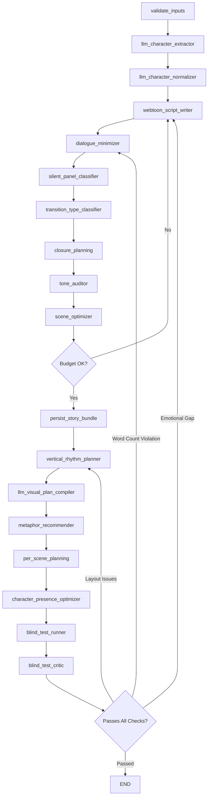

# GossipToon Architecture Improvement Tasks

## Executive Summary

Based on the webtoon storytelling research and your current LangGraph architecture, this document outlines the tasks needed to transform your existing system into a research-aligned webtoon generator that properly converts stories into visual narratives with emotional depth.

---

## Current Architecture Gaps (Based on Research)

| Research Principle | Current State | Gap |
|-------------------|---------------|-----|
| **Closure & Gutter Logic** | No explicit gutter/closure planning | Missing "what happens between panels" inference |
| **Transition Type Selection** | Implicit in panel_plan | No taxonomic transition planning (moment-to-moment, action-to-action, etc.) |
| **Vertical Rhythm Planning** | Layout templates exist | No pixel-distance temporal mapping |
| **Visual Metaphor System** | Not implemented | No emotion-to-symbol mapping engine |
| **Dialogue Minimalism** | webtoon_script_writer exists | No 25% rule enforcement or word count constraints |
| **Silence as Narrative Tool** | Not explicitly planned | No silent panel strategy |
| **Character Presence Logic** | Character extraction exists | No "shown vs implied" decision system |

---

## Phase 1: Core Narrative Grammar Nodes (Priority: HIGH)

### Task 1.1: Create `TransitionTypeClassifier` Node

**Purpose**: Classify each panel-to-panel transition using the 6-type taxonomy

**Location**: `app/graphs/nodes/planning.py`

**Implementation**:
```python
class TransitionType(Enum):
    MOMENT_TO_MOMENT = "moment_to_moment"      # High emotional tension
    ACTION_TO_ACTION = "action_to_action"      # Standard plot progression
    SUBJECT_TO_SUBJECT = "subject_to_subject"  # Multi-character scene
    SCENE_TO_SCENE = "scene_to_scene"          # Time/space jump
    ASPECT_TO_ASPECT = "aspect_to_aspect"      # Mood/atmosphere
    NON_SEQUITUR = "non_sequitur"              # Experimental only
```

**LLM Prompt Logic**:
```
Given two consecutive beats:
- Beat A: {description}
- Beat B: {description}

Classify the transition type and provide:
1. transition_type: one of [moment_to_moment, action_to_action, ...]
2. closure_complexity: low/medium/high (what reader must infer)
3. gutter_implication: what happens in the space between
```

**Integration Point**: Between `webtoon_script_writer` and `scene_optimizer`

---

### Task 1.2: Create `ClosurePlanningNode`

**Purpose**: Explicitly plan what the reader infers in each gutter

**New Artifact Type**: `closure_plan`

**Schema**:
```python
ClosurePlan = {
    "panel_pair": [panel_a_id, panel_b_id],
    "closure_type": "spatial" | "temporal" | "causal",
    "reader_inference": str,  # What the reader will fill in
    "inference_difficulty": float,  # 0-1 scale
    "explicit_if_needed": bool  # Should we add a panel instead?
}
```

**Heuristic Rules**:
- If `inference_difficulty > 0.8` → Add intermediate panel
- If `closure_type == "causal"` AND action is violent → Show result, not action
- Mundane actions (starting car, pouring coffee) → Always infer, never show

---

### Task 1.3: Enhance `webtoon_script_writer` with Beat Classification

**Current**: Produces visual script with narrative beats

**Enhancement**: Each beat must include:
```python
Beat = {
    "beat_id": str,
    "description": str,
    "beat_type": "initial" | "escalation" | "peak" | "release" | "hook",
    "emotional_intensity": float,  # 0-1 scale
    "dialogue_load": float,  # Estimated word count ratio
    "action_complexity": int,  # Number of distinct actions
    "silence_candidate": bool,  # Can this be wordless?
    "metaphor_opportunity": str | None,  # Suggested visual metaphor
}
```

**New Validation**: Reject beats with `action_complexity > 1` (One Action per Panel rule)

---

## Phase 2: Vertical Rhythm & Pacing System (Priority: HIGH)

### Task 2.1: Create `VerticalRhythmPlanner` Node

**Purpose**: Map pixel distances to dramatic weight (webtoon-specific)

**New Artifact Type**: `vertical_rhythm_map`

**Spacing Heuristics** (from research):
| Pacing Category | Pixel Spacing | Trigger Condition |
|-----------------|---------------|-------------------|
| Rapid Action | 30-100px | `beat_type == "escalation"` AND `action_complexity >= 3` |
| Standard Flow | 200-400px | Default conversation/movement |
| Narrative Pause | 600-800px | `emotional_intensity > 0.7` OR `beat_type == "release"` |
| Scene Transition | 1000px+ | `transition_type == "scene_to_scene"` |

**Output Schema**:
```python
RhythmEntry = {
    "panel_id": str,
    "gutter_spacing_px": int,
    "panel_width_pct": 50 | 60 | 80 | 100,
    "is_thumb_stop": bool,  # Should trigger scroll pause
    "scroll_reveal": bool,  # Dramatic reveal on scroll
}
```

---

### Task 2.2: Create Panel Width Hierarchy System

**Purpose**: Signal narrative importance through panel size

**Rules**:
- `100% width` → Impact panels (climax, revelation, establishing shots)
- `80% width` → Standard narrative flow
- `50-60% width` → Intimate close-ups, rapid dialogue, speed emphasis

**Integration**: Add to `rule_layout` node as additional constraint

**New Artifact Field** in `panel_plan`:
```python
panel_hierarchy = {
    "width_percentage": int,
    "hierarchy_reason": "impact" | "standard" | "intimate" | "speed",
    "visual_dominance": "character" | "environment" | "object" | "text"
}
```

---

## Phase 3: Dialogue Minimalism Engine (Priority: HIGH)

### Task 3.1: Create `DialogueMinimizer` Node

**Purpose**: Enforce the 25% rule and word count constraints

**Position in Graph**: After `webtoon_script_writer`, before `panel_plan`

**Constraints** (from research):
| Element | Limit | Enforcement |
|---------|-------|-------------|
| Words per Panel | < 25 | Hard reject if exceeded |
| Bubbles per Panel | 1-2 | Split into multiple panels if > 2 |
| Lines per Bubble | 1-3 | Force line breaks |
| Text Coverage | < 25% of panel | Flag for art team |

**LLM Prompt Pattern**:
```
Original dialogue: "{original}"

Task: Minimize to webtoon format.
Rules:
1. If the art can show it, cut the text
2. Maximum 25 words
3. Remove adverbs from dialogue tags → convert to [Visual Cue: ...]
4. No "I feel X" statements → show via expression

Output:
- minimized_dialogue: str
- visual_cues: list[str]  # What artist must show instead
- can_be_silent: bool
```

---

### Task 3.2: Create `SilentPanelClassifier`

**Purpose**: Identify panels that should have NO dialogue

**Silent Panel Types** (from research):
1. **Action Panels**: Self-explanatory movements
2. **Continuity Panels**: Decompressed single action
3. **Reaction Panels**: Psychological impact moment

**Classification Rules**:
```python
def should_be_silent(beat: Beat) -> bool:
    if beat.action_complexity == 1 and beat.is_self_explanatory:
        return True  # Action panel
    if beat.is_decomposed_moment:
        return True  # Continuity panel
    if beat.beat_type == "release" and beat.emotional_intensity > 0.8:
        return True  # Reaction panel
    return False
```

**Output**: Add `is_silent: bool` and `silence_type: str` to panel plan

---

## Phase 4: Visual Metaphor System (Priority: MEDIUM)

### Task 4.1: Create Visual Metaphor Lexicon Database

**Purpose**: Map emotions to webtoon-specific visual symbols

**Database Schema** (Postgres/JSON):
```sql
CREATE TABLE visual_metaphors (
    emotion_category VARCHAR(50),  -- anger, sadness, anxiety, etc.
    source_domain VARCHAR(100),    -- heat, natural_force, spatial
    visual_manifestation TEXT,     -- "steam from ears", "rain background"
    intensity_level INT,           -- 1-5 scale
    usage_context VARCHAR(50)      -- "reaction_shot", "background", "full_panel"
);
```

**Seed Data** (from research):
| Emotion | Visual Metaphor | Context |
|---------|-----------------|---------|
| Anxiety | Large sweat drop (Plewds) | Reaction shot |
| Anger | Spiky speech bubble, flame eyes, veins | Full panel |
| Shock | "The Scream" pose, arched back | Full panel |
| Self-Doubt | Character shrunk in panel | Composition |
| Isolation | Small figure in vast white space | Full panel |
| Greed | $ or ¥ symbols as eyes | Close-up |

---

### Task 4.2: Create `MetaphorRecommender` Node

**Purpose**: Suggest visual metaphors for emotional beats

**Position**: Part of `llm_panel_semantics` enhancement

**LLM Prompt**:
```
Scene emotional context: {emotion_from_tone_analysis}
Character internal state: {inferred_state}

From the visual metaphor lexicon, recommend:
1. Primary metaphor: The main visual symbol
2. Background treatment: Environmental reinforcement
3. Character modification: How to alter appearance
4. Intensity match: Does the metaphor match the emotion intensity?

Available metaphors: {lexicon_subset}
```

**Output Addition to `panel_semantics`**:
```python
metaphor_direction = {
    "primary_symbol": str,
    "background_mood": str,
    "character_modification": str,
    "conceptual_mapping": str  # e.g., "ANGER IS HEAT"
}
```

---

## Phase 5: Enhanced Scene Planning (Priority: MEDIUM)

### Task 5.1: Enhance `llm_scene_intent` with Narrative Arc Mapping

**Current**: Produces `cinematic_mode`, `continuity_preference`, `shot_variety_preference`

**Add**:
```python
scene_intent = {
    # ... existing fields ...
    "narrative_arc": {
        "initial_panels": list[int],  # Panel indices for setup
        "peak_panels": list[int],     # Panel indices for climax
        "release_panels": list[int],  # Panel indices for resolution
    },
    "character_presence_map": {
        "character_code": {
            "shown_panels": list[int],
            "implied_panels": list[int],
            "implication_method": str  # "shadow", "off_panel_voice", "object"
        }
    },
    "pacing_profile": "action" | "drama" | "comedy" | "atmospheric"
}
```

---

### Task 5.2: Create `CharacterPresenceOptimizer` Node

**Purpose**: Decide when characters should be shown vs implied

**Heuristic Rules**:
- Show character when: They speak, they're the subject of action, emotional climax
- Imply character when: Focus should be on another character's reaction, suspense building
- Off-panel techniques: Shadow, reaching hand, voice bubble from edge

**Output**:
```python
presence_decision = {
    "panel_id": str,
    "character_code": str,
    "visibility": "full" | "partial" | "implied" | "absent",
    "implication_technique": str | None,
    "focal_reason": str  # Why this visibility choice
}
```

---

## Phase 6: Episode-Level Improvements (Priority: MEDIUM)

### Task 6.1: Add Genre-Aware Panel Count Constraints

**Current**: `panel_count` is a general parameter

**Enhancement** (from research):
| Genre | Panels per Episode | Pacing Note |
|-------|-------------------|-------------|
| Action | 60-70 | Many action-to-action transitions |
| Fantasy | 50-60 | Include world-building aspect shots |
| Romance/Drama | 40-50 | Focus on reaction and silent panels |
| Comedy | 30-40 | Tight punchline timing |

**Implementation**: Add to `StoryBuildState`:
```python
genre_profile = {
    "primary_genre": str,
    "panel_count_range": tuple[int, int],
    "required_shot_types": list[str],  # e.g., ["establishing", "reaction"]
    "forbidden_transitions": list[str],  # e.g., comedy rarely uses aspect-to-aspect
}
```

---

### Task 6.2: Enhance Cliffhanger Detection and Placement

**Current**: `blind_test_runner` evaluates narrative coherence

**Add Cliffhanger Requirements**:
```python
cliffhanger_spec = {
    "type": "plot_reveal" | "danger" | "emotional_peak" | "question",
    "scroll_position": "end",  # Always at episode end
    "next_episode_hook": str,  # What question does reader have?
    "spacing_before": 800,  # Dramatic pause pixel count
}
```

**Validation Rule**: Episode must end with `panel_hierarchy.width_percentage == 100`

---

## Phase 7: Quality and Validation Enhancements (Priority: LOW)

### Task 7.1: Enhance `qc_check` with Research-Based Validation

**Current**: "Soft guidelines instead of hard rules"

**Add Hard Rules**:
1. **Word Count Violation**: Any panel with > 25 words → ERROR
2. **Multi-Action Violation**: Any panel describing > 1 action → WARNING
3. **Monotonous Layout**: > 3 consecutive panels with same width → WARNING
4. **Missing Closure Plan**: Any transition without closure definition → WARNING
5. **Dialogue Redundancy**: Text describing what image shows → ERROR

**New QC Report Fields**:
```python
qc_report = {
    # ... existing ...
    "word_count_violations": list[panel_id],
    "multi_action_violations": list[panel_id],
    "layout_monotony_score": float,
    "closure_coverage": float,  # % of transitions with closure plans
    "show_dont_tell_violations": list[panel_id],
}
```

---

### Task 7.2: Enhance `blind_test_critic` with Emotional Delivery Check

**Current**: Evaluates `emotional_takeaway`, `visual_storytelling_observations`

**Add**:
```python
emotional_delivery_check = {
    "intended_emotions": list[str],  # From tone_analysis
    "conveyed_emotions": list[str],  # What the test reader felt
    "emotional_gap": float,  # 0 = perfect match, 1 = complete mismatch
    "gap_reasons": list[str],  # Why emotions didn't land
    "metaphor_effectiveness": float,  # Did visual metaphors work?
}
```

---

## Phase 8: New Graph Architecture Proposal

### Proposed Flow (Enhanced StoryBuildGraph)



---

## Implementation Priority Order

### Sprint 1 (Week 1-2): Foundation
1. ✅ Task 1.1: TransitionTypeClassifier
2. ✅ Task 3.1: DialogueMinimizer
3. ✅ Task 3.2: SilentPanelClassifier

### Sprint 2 (Week 3-4): Rhythm & Pacing
4. ✅ Task 2.1: VerticalRhythmPlanner
5. ✅ Task 2.2: Panel Width Hierarchy
6. ✅ Task 1.2: ClosurePlanningNode

### Sprint 3 (Week 5-6): Visual Language
7. ✅ Task 4.1: Visual Metaphor Lexicon
8. ✅ Task 4.2: MetaphorRecommender
9. ✅ Task 1.3: Beat Classification Enhancement

### Sprint 4 (Week 7-8): Scene & Episode Polish
10. ✅ Task 5.1: Scene Intent Enhancement
11. ✅ Task 5.2: CharacterPresenceOptimizer
12. ✅ Task 6.1: Genre-Aware Panel Counts
13. ✅ Task 6.2: Cliffhanger Enhancement

### Sprint 5 (Week 9-10): Quality & Testing
14. ✅ Task 7.1: Enhanced QC Check
15. ✅ Task 7.2: Emotional Delivery Check
16. ✅ Integration Testing & Prompt Refinement

---

## New Artifacts Summary

| Artifact Type | Node Producer | Purpose |
|---------------|---------------|---------|
| `transition_map` | TransitionTypeClassifier | Panel-to-panel transition taxonomy |
| `closure_plan` | ClosurePlanningNode | Reader inference definitions |
| `vertical_rhythm_map` | VerticalRhythmPlanner | Pixel spacing and width assignments |
| `dialogue_minimized` | DialogueMinimizer | Constrained dialogue output |
| `silence_assignments` | SilentPanelClassifier | Which panels are wordless |
| `metaphor_directions` | MetaphorRecommender | Visual symbol recommendations |
| `presence_map` | CharacterPresenceOptimizer | Show/imply decisions |

---

## Key Research Principles Checklist

After implementation, verify these principles are embedded:

- [ ] **Closure is planned, not accidental**: Every gutter has explicit reader inference
- [ ] **Vertical space = dramatic weight**: Pixel distance maps to emotional intensity
- [ ] **One Action per Panel**: Enforced at beat breakdown level
- [ ] **25% Text Rule**: Hard-coded word count limits
- [ ] **Silence is strategic**: At least 20% of panels should be silent in drama
- [ ] **Visual metaphors replace exposition**: Emotions shown via symbols, not stated
- [ ] **Panel width signals hierarchy**: 100% = impact, 80% = flow, 60% = intimate
- [ ] **Cliffhangers are engineered**: Every episode ends with scroll-optimized hook

---

## Appendix: Sample Prompt Templates

### Transition Classification Prompt
```
You are a webtoon narrative architect. Analyze this panel transition:

PANEL A: {panel_a_description}
PANEL B: {panel_b_description}

Classify using McCloud's transition taxonomy:
1. MOMENT_TO_MOMENT: Same subject, minuscule time gap (blinking)
2. ACTION_TO_ACTION: Same subject, meaningful action progression
3. SUBJECT_TO_SUBJECT: Different subjects, same scene
4. SCENE_TO_SCENE: Different location or significant time jump
5. ASPECT_TO_ASPECT: Same moment, different viewpoints (atmosphere)
6. NON_SEQUITUR: No logical connection (rare, artistic)

Also provide:
- What the reader MUST infer in the gutter
- Closure difficulty (easy/medium/hard)
- Should an intermediate panel be added? (yes/no with reason)
```

### Dialogue Minimization Prompt
```
You are a webtoon dialogue editor. Your job is to cut words ruthlessly.

ORIGINAL: {original_dialogue}
CONTEXT: {scene_context}
CHARACTER: {speaker}

Rules:
1. Maximum 25 words total
2. If the art shows it, don't say it
3. Convert adverbs to [VISUAL CUE: ...]
4. "I feel X" → Must be shown, not said
5. Prefer incomplete sentences (natural speech)

Output format:
MINIMIZED: [the cut dialogue]
VISUAL_CUES: [what artist must show instead]
CAN_BE_SILENT: [yes/no - can we cut ALL dialogue?]
```

### Visual Metaphor Selection Prompt
```
You are a manhwa/webtoon visual language expert.

EMOTION TO CONVEY: {emotion}
INTENSITY: {1-5 scale}
CONTEXT: {scene_description}

Select from the visual metaphor lexicon:
{available_metaphors}

Recommend:
1. PRIMARY_SYMBOL: Main visual representation
2. BACKGROUND_TREATMENT: How environment reinforces mood
3. CHARACTER_MODIFICATION: How to alter character appearance
4. PLACEMENT: Where in the panel (reaction shot, background, full panel)
5. CULTURAL_NOTE: Any culture-specific considerations
```
