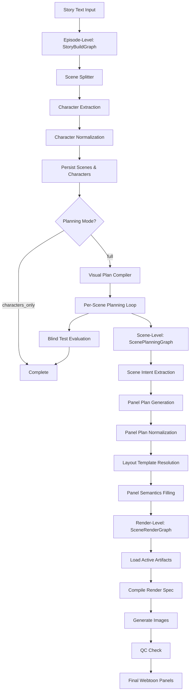

# Application Workflow

## Overview

The ssuljaengi_v4 system transforms story text into fully rendered webtoon panels through a three-tier LangGraph-based pipeline. The system processes stories at the episode level (extracting characters and scenes), plans each scene (breaking into panels with visual descriptions), and renders final images with layout and styling.

## Three-Tier Architecture

The system operates through three distinct processing levels:

### 1. Episode-Level Processing (StoryBuildGraph)

**Purpose**: Convert raw story text into structured scenes and characters

**Key Operations**:
- Split story text into scenes (max 30 scenes)
- Extract and normalize character profiles with visual details
- Assign canonical codes (CHAR_A, CHAR_B, etc.) for character consistency
- Persist scenes and characters to database
- Optionally run full planning pipeline for all scenes

**Planning Modes**:
- `full` - Complete episode processing including per-scene planning (8 steps)
- `characters_only` - Extract characters and scenes only, skip planning (5 steps)

**Episode-Level Guardrails**:
- Prevents 3+ consecutive scenes with identical layout templates
- Enforces at least one hero single-panel scene when requested
- Deduplicates characters by name across stories

### 2. Scene-Level Processing (ScenePlanningGraph)

**Purpose**: Break scenes into panels with visual descriptions

**Key Operations**:
- Extract narrative intent (mood, pacing, key moments)
- Generate panel plan with shot types (grammar IDs)
- Normalize panel plan (validate grammar, fix structure)
- Resolve layout template based on panel count
- Fill panel semantics (detailed visual descriptions for each panel)

**Planning Lock**: Scenes can be locked to prevent regeneration, preserving manual edits

### 3. Render-Level Processing (SceneRenderGraph)

**Purpose**: Generate final images from panel descriptions

**Key Operations**:
- Load active artifacts (panel semantics, layout template)
- Resolve style hierarchy (scene override → story default → "default")
- Compile render spec with prompts for each panel
- Generate images via Vertex AI Gemini API
- Run QC checks (optional enforcement)

**Style Resolution**: Scene-specific overrides take precedence over story defaults

## Key Concepts

### Artifacts

**What**: Versioned intermediate outputs stored in database (JSON payloads)

**Why**: Enable resumable workflows, audit trails, and manual editing

**Types**:
- `scene_intent` - Narrative analysis (mood, pacing, key moments)
- `panel_plan` - Panel breakdown with shot types
- `panel_plan_normalized` - Validated and corrected panel plan
- `layout_template` - Panel geometry (x, y, w, h coordinates)
- `panel_semantics` - Detailed visual descriptions per panel
- `render_spec` - Final prompts for image generation
- `render_result` - Generated image URLs and metadata
- `qc_report` - Quality control validation results
- `blind_test_report` - Narrative coherence evaluation
- `dialogue_suggestions` - Extracted dialogue for text layers
- `visual_plan` - Scene importance and visual beats

**Versioning**: Auto-increments per (scene_id, type) with parent-child lineage

### Synchronous vs Asynchronous Processing

**Synchronous** (Scene-level and Render-level):
- Direct API calls return results immediately
- Used for single scene operations
- Examples: `POST /v1/scenes/{id}/generate/intent`, `POST /v1/scenes/{id}/generate/render`

**Asynchronous** (Episode-level):
- Long-running operations processed in background
- Job queue manages execution
- Progress tracked in `Story.progress` JSON field
- Examples: `POST /v1/stories/{id}/generate/blueprint`

## Workflow Diagram



## Key Files

- `app/graphs/story_build.py` - Episode-level workflow (StoryBuildGraph)
- `app/graphs/pipeline.py` - Scene and render workflows (ScenePlanningGraph, SceneRenderGraph)
- `app/graphs/nodes/` - Individual node implementations
- `app/services/artifacts.py` - Artifact versioning and storage service
- `app/services/vertex_gemini.py` - Gemini API client with retry logic
- `app/db/models.py` - Database models (Story, Scene, Character, Artifact, etc.)

## Debugging Direction

**When workflows get stuck, check:**

- **Episode-level issues**:
  - Check `Story.progress` field for current step and error messages
  - Review `Story.generation_status` (running, completed, failed)
  - Inspect `Story.generation_error` for failure details
  - Verify `max_scenes`, `max_characters`, `panel_count` are within limits (1-30, 1-20, 1-12)

- **Scene-level issues**:
  - Check `Scene.planning_locked` - if true, planning won't regenerate
  - Review artifacts table for scene_id to see which steps completed
  - Inspect artifact payloads for LLM outputs and error messages
  - Verify `Scene.source_text` contains valid input

- **Render-level issues**:
  - Check `Scene.image_style_override` and `Story.default_image_style` for style resolution
  - Review `render_spec` artifact for compiled prompts
  - Inspect `qc_report` artifact for validation failures
  - Check Gemini API logs for rate limits or content filtering

- **Artifact issues**:
  - Query artifacts table: `SELECT * FROM artifacts WHERE scene_id = ? ORDER BY type, version`
  - Check artifact.version for latest version per type
  - Review artifact.parent_id for lineage tracking
  - Inspect artifact.payload for node outputs

**Useful queries**:

```sql
-- Check story progress
SELECT story_id, generation_status, progress, generation_error 
FROM stories WHERE story_id = ?;

-- List all artifacts for a scene
SELECT type, version, created_at 
FROM artifacts WHERE scene_id = ? 
ORDER BY type, version DESC;

-- Find scenes with planning locked
SELECT scene_id, planning_locked 
FROM scenes WHERE story_id = ?;
```

## See Also

- [LangGraph Architecture](02-langgraph-architecture.md) - Detailed graph and node documentation
- [Artifact System](06-artifact-system.md) - Versioning and storage patterns
- [Database Models](04-database-models.md) - Complete schema documentation
- [Error Handling & Observability](09-error-handling-observability.md) - Debugging and monitoring
- [SKILLS.md](../SKILLS.md) - Quick reference guide
