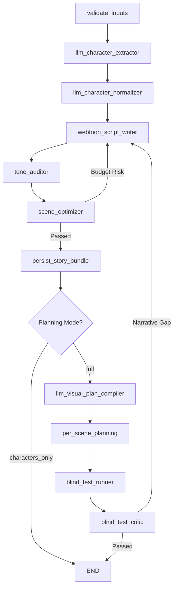
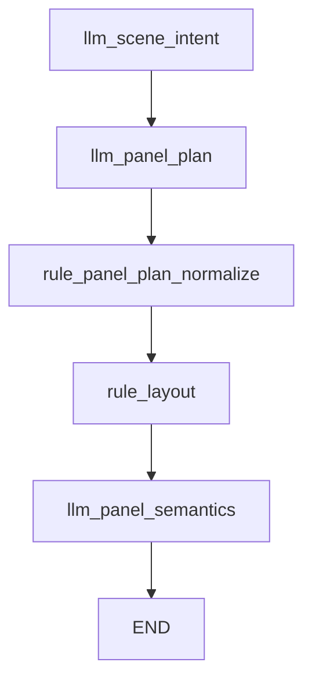
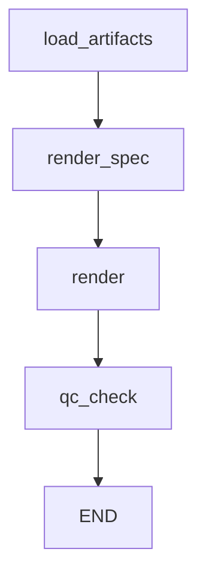

# LangGraph Architecture

## Overview

The system uses three LangGraph state machines to orchestrate the webtoon generation pipeline. Each graph manages a distinct processing tier with its own state schema and node implementations. Graphs coordinate LLM calls, rule-based processing, and database persistence through a series of connected nodes.

## Three Main Graphs

### StoryBuildGraph (Episode-Level)

**Purpose**: Process entire stories into scenes and characters, optionally running full planning pipeline

**File**: `app/graphs/story_build.py`

**Planning Modes**:

- `full` - Complete processing with per-scene planning, tone auditing, and iterative narrative validation (11+ steps)
- `characters_only` - Extract characters and scenes only (6 steps)

### ScenePlanningGraph (Scene-Level)

**Purpose**: Break individual scenes into panels with visual descriptions

**File**: `app/graphs/pipeline.py`

**Planning Lock**: When `Scene.planning_locked = true`, returns existing artifacts instead of regenerating

### SceneRenderGraph (Render-Level)

**Purpose**: Generate final images from panel descriptions with style resolution

**File**: `app/graphs/pipeline.py`

**Style Resolution Hierarchy**: Scene override → Story default → "default"

## StoryBuildGraph Details

### Key Nodes

- **validate_inputs** - Validate and normalize input parameters (max_scenes, max_characters, panel_count)
- **llm_character_extractor** - Extract character profiles from story text
- **llm_character_normalizer** - Add visual details (hair, face, build, outfit) and narrative descriptions to characters
- **webtoon_script_writer** - Translate raw story into a visual script with narrative beats, dialogue, and SFX
- **tone_auditor** - Analyze mood shifts and assign narrative weights to beats
- **scene_optimizer** - Optimize beats into final scenes based on budget and tone weights
- **persist_story_bundle** - Save optimized scenes, characters, and script to database
- **llm_visual_plan_compiler** - Convert scenes to visual beats with importance ratings _(full mode only)_
- **per_scene_planning** - Run ScenePlanningGraph for each scene with level guardrails _(full mode only)_
- **blind_test_runner** - Evaluate narrative coherence of panel plans _(full mode only)_
- **blind_test_critic** - Analyze blind test reports for narrative gaps and trigger rewrites if needed _(full mode only)_

### Episode-Level Guardrails

Implemented in `per_scene_planning` node:

1. **Layout Template Diversity**: Prevents 3+ consecutive scenes with identical templates
   - Tracks last 3 template IDs
   - Excludes repeated template and re-resolves if needed

2. **Hero Single-Panel Enforcement**: Ensures at least one single-panel scene when `require_hero_single = true`
   - Prefers cliffhanger scenes for conversion
   - Falls back to last scene if no cliffhanger found
   - Re-runs planning with `panel_count = 1`

3. **Character Deduplication**: Merges characters by name across stories
   - Case-insensitive name matching
   - Assigns canonical codes (CHAR_A, CHAR_B, etc.)
   - Preserves existing character data, fills missing fields

### Flow Diagram



### State Schema: StoryBuildState

**Input Fields**:

- `story_id` - UUID of story being processed
- `story_text` - Raw story text input
- `max_scenes` - Maximum scenes to create (1-30)
- `max_characters` - Maximum characters to extract (1-20)
- `panel_count` - Panels per scene (1-12)
- `allow_append` - Allow adding scenes to existing story
- `image_style` - Image generation style preset ID
- `planning_mode` - "full" or "characters_only"
- `require_hero_single` - Enforce at least one single-panel scene

**Output Fields**:

- `scenes` - List of scene dictionaries (scene_index, title, summary, source_text)
- `characters` - List of character profile dictionaries
- `scene_ids` - List of created scene UUIDs
- `character_ids` - List of created character UUIDs
- `visual_plan_bundle` - List of visual plan payloads _(full mode)_
- `visual_plan_artifact_ids` - List of visual plan artifact UUIDs _(full mode)_
- `planning_artifact_ids` - List of planning artifact dictionaries per scene _(full mode)_
- `blind_test_report_ids` - List of blind test artifact UUIDs _(full mode)_
- `progress` - Progress tracking dictionary (current_node, message, step)
- `webtoon_script` - Structured visual script with beats and dialogue
- `feedback` - History of director/critic feedback for iteration
- `script_drafts` - Versioned drafts of the webtoon script
- `tone_analysis` - Mood segments and beat-level importance weights
- `retry_count` - Current iteration number for optimization/critic loops
- `max_retries` - Hard limit on rewrite attempts

## ScenePlanningGraph Details

### Key Nodes

- **`scene_intent`**: Narrative analysis including `cinematic_mode`, `continuity_preference`, and `shot_variety_preference`
- **`panel_plan`**: Panel breakdown with `grammar_id`, `importance_weight`, and `recommended_focus`
- **`panel_plan_normalized`**: Validated panel plan (creative layouts preferred)
- **rule_layout** - Resolve layout template based on panel count and emphasis
- **llm_panel_semantics** - Fill detailed visual descriptions for each panel using cinematographer principles

### Planning Lock Concept

When `Scene.planning_locked = true`:

- Graph execution is skipped
- Returns existing artifacts from database
- Raises error if required artifacts are missing
- Preserves manual edits to panel plans

**Required Artifacts for Locked Planning**:

- `scene_intent`
- `panel_plan`
- `panel_plan_normalized`
- `layout_template`
- `panel_semantics`

### Flow Diagram



### State Schema: PlanningState

**Input Fields**:

- `scene_id` - UUID of scene being planned
- `panel_count` - Number of panels to generate (1-12)
- `genre` - Optional genre for style guidance

**Output Fields**:

- `scene_intent_artifact_id` - UUID of scene intent artifact
- `panel_plan_artifact_id` - UUID of panel plan artifact
- `panel_plan_normalized_artifact_id` - UUID of normalized panel plan artifact
- `layout_template_artifact_id` - UUID of layout template artifact
- `panel_semantics_artifact_id` - UUID of panel semantics artifact

## SceneRenderGraph Details

### Key Nodes

- **load_artifacts** - Load active panel semantics and layout template artifacts
- **render_spec** - Compile final prompts for each panel with style resolution
- **render** - Generate images via Vertex AI Gemini API
- **qc_check** - Run quality control validation (optional enforcement)

### Style Resolution Hierarchy

The system resolves image styles in this order:

1. **Scene Override**: `Scene.image_style_override` (highest priority)
2. **Story Default**: `Story.default_image_style`
3. **System Default**: "default" (fallback)

Style resolution happens in `load_artifacts` node and is passed to `render_spec` for prompt compilation.

### Flow Diagram



### State Schema: RenderState

**Input Fields**:

- `scene_id` - UUID of scene being rendered
- `style_id` - Optional style preset ID (resolved if not provided)
- `prompt_override` - Optional custom prompt text
- `enforce_qc` - Whether to raise error on QC failure

**Output Fields**:

- `panel_semantics_artifact_id` - UUID of loaded panel semantics artifact
- `layout_template_artifact_id` - UUID of loaded layout template artifact
- `render_spec_artifact_id` - UUID of compiled render spec artifact
- `render_result_artifact_id` - UUID of render result artifact
- `qc_report_artifact_id` - UUID of QC report artifact

## Additional State Schema: PipelineState

**Purpose**: Combined state for full pipeline execution (planning + render)

**File**: `app/graphs/pipeline.py` - `run_full_pipeline()` function

**Fields**: Union of PlanningState and RenderState fields, plus:

- `blind_test_report_artifact_id` - UUID of blind test evaluation artifact

## Key Files

### Graph Implementations

- `app/graphs/story_build.py` - StoryBuildGraph implementation
- `app/graphs/pipeline.py` - ScenePlanningGraph and SceneRenderGraph implementations

### Node Implementations

- `app/graphs/nodes/__init__.py` - Node function exports
- `app/graphs/nodes/planning.py` - Planning node implementations
- `app/graphs/nodes/rendering.py` - Rendering node implementations
- `app/graphs/nodes/prompts/` - Prompt compilation logic
- `app/graphs/nodes/helpers/` - Helper utilities
- `app/graphs/nodes/constants.py` - Artifact type constants
- `app/graphs/nodes/utils.py` - Shared utilities

### Supporting Services

- `app/services/artifacts.py` - Artifact versioning and storage
- `app/services/vertex_gemini.py` - Gemini API client with retry logic
- `app/core/telemetry.py` - Graph execution tracing
- `app/core/metrics.py` - Graph node metrics collection

## Debugging Direction

**When graphs fail or produce unexpected results, check:**

### StoryBuildGraph Issues

- **Progress tracking**: Check `Story.progress` field for current node and error messages
- **Character deduplication**: Review `Character.canonical_code` assignments in database
- **Scene splitting**: Inspect `scenes` list in state for scene count and text distribution
- **Planning mode**: Verify `planning_mode` is "full" or "characters_only"
- **Guardrail violations**: Check logs for template exclusion or hero single enforcement

**Useful queries**:

```sql
-- Check story progress
SELECT story_id, generation_status, progress, generation_error
FROM stories WHERE story_id = ?;

-- Review character assignments
SELECT canonical_code, name, role, gender, age_range
FROM characters WHERE project_id = ?;
```

### ScenePlanningGraph Issues

- **Planning lock**: Check `Scene.planning_locked` - if true, graph returns existing artifacts
- **Missing artifacts**: Verify all required artifacts exist for locked scenes
- **Panel count**: Ensure `panel_count` is within limits (1-12)
- **Grammar validation**: Review `panel_plan_normalized` artifact for grammar ID corrections
- **Layout resolution**: Check `layout_template` artifact for selected template ID

**Useful queries**:

```sql
-- Check planning lock status
SELECT scene_id, planning_locked FROM scenes WHERE scene_id = ?;

-- List planning artifacts
SELECT type, version, created_at
FROM artifacts
WHERE scene_id = ? AND type IN (
  'scene_intent', 'panel_plan', 'panel_plan_normalized',
  'layout_template', 'panel_semantics'
)
ORDER BY type, version DESC;
```

### SceneRenderGraph Issues

- **Style resolution**: Check `Scene.image_style_override` and `Story.default_image_style`
- **Missing artifacts**: Verify `panel_semantics` and `layout_template` artifacts exist
- **QC enforcement**: Review **`qc_report`**: Visual storytelling checking (soft guidelines instead of hard rules)
- **`blind_test_report`**: Evaluation of narrative clarity and emotional delivery (`emotional_takeaway`, `visual_storytelling_observations`)
- **Gemini API errors**: Review logs for rate limits, content filtering, or quota issues

**Useful queries**:

```sql
-- Check style resolution
SELECT s.scene_id, s.image_style_override, st.default_image_style
FROM scenes s
JOIN stories st ON s.story_id = st.story_id
WHERE s.scene_id = ?;

-- Review render artifacts
SELECT type, version, payload
FROM artifacts
WHERE scene_id = ? AND type IN (
  'render_spec', 'render_result', 'qc_report'
)
ORDER BY type, version DESC;
```

### General Graph Debugging

- **Telemetry traces**: Check OpenTelemetry spans for graph execution timing
- **Metrics**: Review Prometheus metrics for node execution counts and durations
- **Artifact payloads**: Inspect artifact.payload JSON for node outputs and errors
- **State inspection**: Log state at each node to track data flow
- **Node failures**: Check logs for exceptions in individual node functions

**Key log patterns to search**:

- `graph.story_build` - StoryBuildGraph execution traces
- `graph.scene_planning` - ScenePlanningGraph execution traces
- `graph.scene_render` - SceneRenderGraph execution traces
- `graph_node_execution` - Individual node metrics

## See Also

- [Application Workflow](01-application-workflow.md) - High-level system overview
- [Prompt System](03-prompt-system.md) - Prompt templates and compilation
- [Artifact System](06-artifact-system.md) - Versioning and storage patterns
- [Database Models](04-database-models.md) - Complete schema documentation
- [Error Handling & Observability](09-error-handling-observability.md) - Debugging and monitoring
- [SKILLS.md](../SKILLS.md) - Quick reference guide
