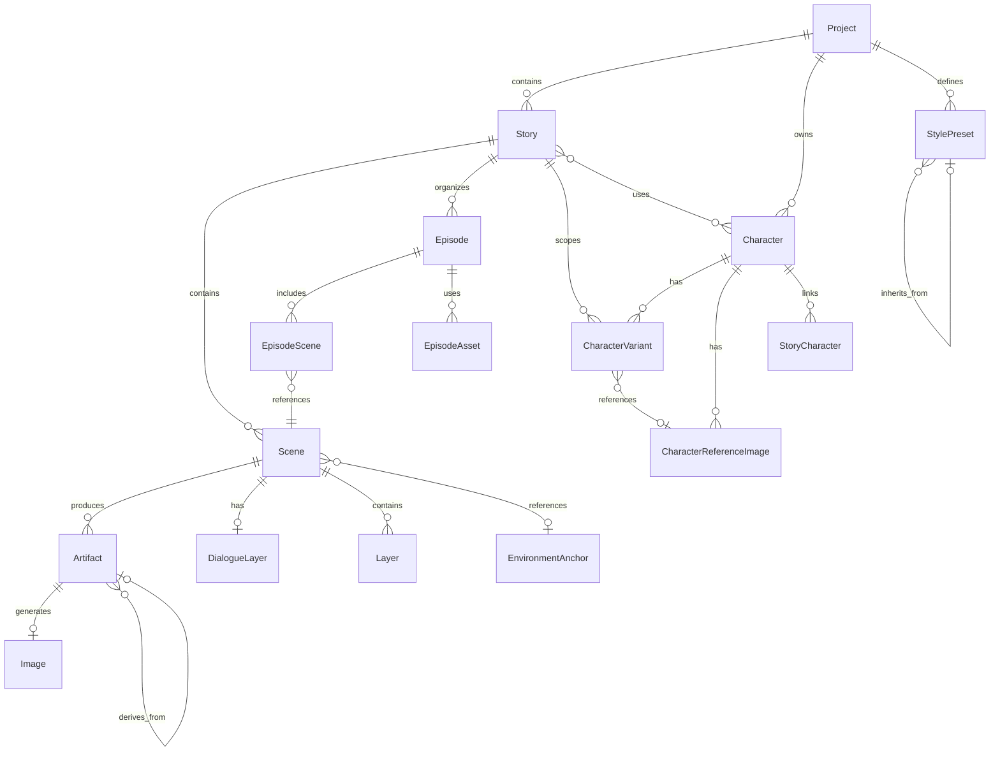

# Database Models

## Overview

The system uses SQLAlchemy ORM with PostgreSQL to manage all persistent data. Models follow a hierarchical structure (Project → Story → Scene) with supporting systems for characters, artifacts, and styling. All models use UUID primary keys and include timestamp tracking for audit trails.

## Entity Relationship Diagram



## Core Hierarchy

### Project

**Purpose**: Top-level container for all content

**Key Fields**:
- `project_id` - UUID primary key
- `name` - Project display name
- `created_at` - Creation timestamp

**Relationships**:
- One-to-many with `Story`, `Character`, `StylePreset`

### Story

**Purpose**: Narrative container with generation settings and progress tracking

**Key Fields**:
- `story_id` - UUID primary key
- `project_id` - Foreign key to Project
- `title` - Story display name
- `default_image_style` - Default style preset for image generation
- `generation_status` - Current status (idle, processing, completed, failed)
- `generation_error` - Error message if generation failed
- `progress` - JSON field tracking current graph node and progress
- `progress_updated_at` - Last progress update timestamp

**Relationships**:
- Belongs to `Project`
- One-to-many with `Scene`, `Episode`, `CharacterVariant`
- Many-to-many with `Character` via `StoryCharacter`

### Scene

**Purpose**: Individual narrative unit that becomes one or more webtoon panels

**Key Fields**:
- `scene_id` - UUID primary key
- `story_id` - Foreign key to Story
- `source_text` - Raw scene text input
- `scene_importance` - Importance rating (critical, high, medium, low)
- `planning_locked` - Prevents regeneration when true
- `image_style_override` - Optional image style override for this scene
- `environment_id` - Optional reference to reusable environment

**Relationships**:
- Belongs to `Story`
- One-to-many with `Artifact`
- One-to-one with `DialogueLayer`
- One-to-many with `Layer`
- Many-to-one with `EnvironmentAnchor` (optional)

## Character System Models

### Character

**Purpose**: Character definition with visual details and identity

**Key Fields**:
- `character_id` - UUID primary key
- `project_id` - Foreign key to Project (nullable for global actors)
- `canonical_code` - Sequential identifier (CHAR_A, CHAR_B, etc.)
- `name` - Character name
- `role` - Character role (protagonist, antagonist, secondary, etc.)
- `gender` - Gender for style mapping (male, female, non_binary)
- `age_range` - Age range for style mapping (child, teen, young_adult, adult, middle_aged, elderly)
- `appearance` - JSON field with visual details
- `hair_description` - Hair style and color description
- `base_outfit` - Default outfit description
- `identity_line` - Compiled character description for prompts
- `is_library_saved` - Whether character is saved to Actor library
- `approved` - Whether character is approved for use

**Actor System**: Characters with `project_id = NULL` are global actors reusable across projects

**Relationships**:
- Belongs to `Project` (optional for actors)
- Many-to-many with `Story` via `StoryCharacter`
- One-to-many with `CharacterVariant`, `CharacterReferenceImage`

### StoryCharacter

**Purpose**: Junction table linking characters to stories

**Key Fields**:
- `story_id` - Foreign key to Story (composite primary key)
- `character_id` - Foreign key to Character (composite primary key)
- `created_at` - Link creation timestamp

### CharacterVariant

**Purpose**: Specific appearance variation of a character (outfit change, mood change, etc.)

**Key Fields**:
- `variant_id` - UUID primary key
- `character_id` - Foreign key to Character
- `story_id` - Foreign key to Story (nullable for global variants)
- `variant_type` - Type of variant (base, outfit_change, mood_change, etc.)
- `variant_name` - Display name (e.g., "Summer Look", "Battle Mode")
- `traits` - JSON field with visual traits (face, hair, mood, outfit)
- `override_attributes` - JSON field with attribute overrides
- `reference_image_id` - Optional reference image
- `generated_image_ids` - List of generated image UUIDs
- `is_default` - Whether this is the default variant
- `is_active_for_story` - Whether this variant is currently active

**Scoping**: Variants can be story-specific (`story_id` set) or global (`story_id = NULL`)

**Relationships**:
- Belongs to `Character`
- Belongs to `Story` (optional for global variants)
- References `CharacterReferenceImage` (optional)

### CharacterReferenceImage

**Purpose**: Reference images for character consistency

**Key Fields**:
- `reference_image_id` - UUID primary key
- `character_id` - Foreign key to Character
- `image_url` - URL to reference image
- `ref_type` - Type of reference (face, full_body, etc.)
- `approved` - Whether image is approved for use
- `is_primary` - Whether this is the primary reference
- `metadata_` - JSON field with additional metadata

**Relationships**:
- Belongs to `Character`

### CharacterVariantSuggestion

**Purpose**: AI-generated suggestions for character variants based on story context

**Key Fields**:
- `suggestion_id` - UUID primary key
- `story_id` - Foreign key to Story
- `character_id` - Foreign key to Character
- `variant_type` - Suggested variant type
- `override_attributes` - JSON field with suggested attributes

## Artifact System

### Artifact

**Purpose**: Versioned intermediate outputs from graph nodes

**Key Fields**:
- `artifact_id` - UUID primary key
- `scene_id` - Foreign key to Scene
- `type` - Artifact type (scene_intent, panel_plan, render_spec, etc.)
- `version` - Auto-incrementing version number per (scene_id, type)
- `parent_id` - Foreign key to parent Artifact (for lineage tracking)
- `payload` - JSON field with artifact data
- `created_by` - User or system identifier
- `updated_by` - Last updater identifier

**Versioning**: Each (scene_id, type) combination has independent version sequence starting at 1

**Artifact Types**:
- `scene_intent` - Narrative intent extraction
- `panel_plan` - Panel breakdown with shot types
- `panel_plan_normalized` - Validated and corrected panel plan
- `layout_template` - Selected layout template
- `panel_semantics` - Detailed visual descriptions
- `render_spec` - Compiled prompts for image generation
- `render_result` - Generated images and metadata
- `qc_report` - Quality control validation results
- `blind_test_report` - Narrative coherence evaluation
- `dialogue_suggestions` - AI-generated dialogue
- `visual_plan` - Visual beats with importance ratings

**Relationships**:
- Belongs to `Scene`
- Self-referential parent-child relationship via `parent_id`
- One-to-many with `Image`

### Image

**Purpose**: Generated images linked to artifacts

**Key Fields**:
- `image_id` - UUID primary key
- `artifact_id` - Foreign key to Artifact (nullable)
- `image_url` - URL to generated image
- `metadata_` - JSON field with generation metadata

**Relationships**:
- Belongs to `Artifact` (optional)

## Other Key Models

### StylePreset

**Purpose**: Custom style configurations for story/image generation

**Key Fields**:
- `preset_id` - UUID primary key
- `project_id` - Foreign key to Project (nullable for system presets)
- `parent_id` - Foreign key to parent StylePreset (for inheritance)
- `style_type` - Type of preset (story or image)
- `name` - Preset identifier
- `label` - Display name
- `style_config` - JSON field with style configuration
- `is_system` - Whether this is a system-provided preset
- `is_active` - Whether preset is available for use

**Inheritance**: Presets can inherit from parent presets via `parent_id`

### DialogueLayer

**Purpose**: Speech bubbles and dialogue for a scene

**Key Fields**:
- `dialogue_id` - UUID primary key
- `scene_id` - Foreign key to Scene (unique)
- `bubbles` - JSON array of dialogue bubble definitions

### EnvironmentAnchor

**Purpose**: Reusable environment descriptions for consistency

**Key Fields**:
- `environment_id` - UUID primary key
- `description` - Environment description text
- `usage_count` - Number of scenes using this environment
- `anchor_type` - Type of anchor (descriptive, reference_based, etc.)
- `reference_images` - JSON array of reference image URLs
- `locked_elements` - JSON array of elements that must remain consistent
- `pinned` - Whether environment is pinned for easy access

### Layer

**Purpose**: Compositing layers for scene rendering (future feature)

**Key Fields**:
- `layer_id` - UUID primary key
- `scene_id` - Foreign key to Scene
- `layer_type` - Type of layer (background, character, effects, etc.)
- `objects` - JSON array of layer objects

### Episode

**Purpose**: Multi-scene composition for episodic content

**Key Fields**:
- `episode_id` - UUID primary key
- `story_id` - Foreign key to Story
- `title` - Episode title
- `default_image_style` - Default image style for episode
- `status` - Episode status (draft, published, etc.)

### EpisodeScene

**Purpose**: Junction table linking scenes to episodes with ordering

**Key Fields**:
- `episode_scene_id` - UUID primary key
- `episode_id` - Foreign key to Episode
- `scene_id` - Foreign key to Scene
- `order_index` - Scene order within episode

### EpisodeAsset

**Purpose**: Additional assets attached to episodes

**Key Fields**:
- `episode_asset_id` - UUID primary key
- `episode_id` - Foreign key to Episode
- `asset_type` - Type of asset
- `asset_id` - UUID of asset

### ExportJob

**Purpose**: Asynchronous export job tracking

**Key Fields**:
- `export_id` - UUID primary key
- `scene_id` - Foreign key to Scene (optional)
- `episode_id` - Foreign key to Episode (optional)
- `status` - Job status (queued, processing, completed, failed)
- `output_url` - URL to exported file
- `metadata_` - JSON field with export metadata

### AuditLog

**Purpose**: Audit trail for all entity changes

**Key Fields**:
- `audit_id` - UUID primary key
- `entity_type` - Type of entity changed
- `entity_id` - UUID of entity changed
- `action` - Action performed (create, update, delete)
- `request_id` - Correlation ID for request tracking
- `old_value` - JSON snapshot of old values
- `new_value` - JSON snapshot of new values

## Key Files

- `app/db/models.py` - All model definitions
- `app/db/base.py` - SQLAlchemy base configuration
- `app/db/session.py` - Database session management
- `app/services/artifacts.py` - Artifact versioning service
- `app/services/casting.py` - Character variant management
- `app/api/v1/schemas.py` - Pydantic schemas for API requests/responses

## Debugging Direction

**When investigating database issues, check:**

### Character System Issues

- **Canonical code assignment**: Check `Character.canonical_code` for sequential assignment (CHAR_A, CHAR_B, etc.)
- **Character deduplication**: Review `StoryCharacter` links to see which characters are shared across stories
- **Variant activation**: Check `CharacterVariant.is_active_for_story` to see which variant is currently active
- **Actor system**: Look for characters with `project_id = NULL` for global actors

**Useful queries**:
```sql
-- Check character assignments for a project
SELECT canonical_code, name, role, gender, age_range 
FROM characters WHERE project_id = ?;

-- Review active variants for a story
SELECT cv.variant_name, cv.variant_type, cv.is_active_for_story
FROM character_variants cv
WHERE cv.story_id = ? AND cv.is_active_for_story = true;

-- Find global actors
SELECT character_id, name, display_name, is_library_saved, approved
FROM characters WHERE project_id IS NULL;
```

### Artifact System Issues

- **Version conflicts**: Check `Artifact.version` for gaps or duplicates
- **Missing artifacts**: Query artifacts table for required types (scene_intent, panel_plan, etc.)
- **Artifact lineage**: Follow `parent_id` chain to trace artifact derivation
- **Planning lock**: Check `Scene.planning_locked` to see if regeneration is blocked

**Useful queries**:
```sql
-- List all artifacts for a scene
SELECT type, version, created_at, created_by
FROM artifacts 
WHERE scene_id = ?
ORDER BY type, version DESC;

-- Check for missing required artifacts
SELECT type, MAX(version) as latest_version
FROM artifacts
WHERE scene_id = ?
GROUP BY type;

-- Trace artifact lineage
WITH RECURSIVE lineage AS (
  SELECT artifact_id, parent_id, type, version, 0 as depth
  FROM artifacts WHERE artifact_id = ?
  UNION ALL
  SELECT a.artifact_id, a.parent_id, a.type, a.version, l.depth + 1
  FROM artifacts a
  JOIN lineage l ON a.artifact_id = l.parent_id
)
SELECT * FROM lineage ORDER BY depth;
```

### Story Generation Issues

- **Progress tracking**: Check `Story.progress` JSON field for current node and error messages
- **Generation status**: Review `Story.generation_status` (idle, processing, completed, failed)
- **Style resolution**: Check `Scene.image_style_override` and `Story.default_image_style`
- **Scene locking**: Verify `Scene.planning_locked` status

**Useful queries**:
```sql
-- Check story generation status
SELECT story_id, title, generation_status, generation_error, progress
FROM stories WHERE story_id = ?;

-- Review scene style overrides
SELECT scene_id, image_style_override, planning_locked
FROM scenes WHERE story_id = ?;

-- Check style preset inheritance
WITH RECURSIVE style_chain AS (
  SELECT preset_id, parent_id, name, style_config, 0 as depth
  FROM style_presets WHERE preset_id = ?
  UNION ALL
  SELECT sp.preset_id, sp.parent_id, sp.name, sp.style_config, sc.depth + 1
  FROM style_presets sp
  JOIN style_chain sc ON sp.preset_id = sc.parent_id
)
SELECT * FROM style_chain ORDER BY depth;
```

### Episode and Export Issues

- **Scene ordering**: Check `EpisodeScene.order_index` for correct sequence
- **Export status**: Review `ExportJob.status` and `output_url`
- **Episode assets**: Verify `EpisodeAsset` records for required assets

**Useful queries**:
```sql
-- List scenes in episode order
SELECT es.order_index, s.scene_id, s.source_text
FROM episode_scenes es
JOIN scenes s ON es.scene_id = s.scene_id
WHERE es.episode_id = ?
ORDER BY es.order_index;

-- Check export job status
SELECT export_id, status, output_url, metadata_
FROM exports WHERE export_id = ?;
```

### Audit Trail

- **Change tracking**: Query `AuditLog` for entity change history
- **Request correlation**: Use `request_id` to trace all changes from a single request

**Useful queries**:
```sql
-- Review entity change history
SELECT action, timestamp, old_value, new_value
FROM audit_logs
WHERE entity_type = ? AND entity_id = ?
ORDER BY timestamp DESC;

-- Trace all changes from a request
SELECT entity_type, entity_id, action, timestamp
FROM audit_logs
WHERE request_id = ?
ORDER BY timestamp;
```

## See Also

- [LangGraph Architecture](02-langgraph-architecture.md) - How graphs interact with models
- [Character System](05-character-system.md) - Character extraction and variant system
- [Artifact System](06-artifact-system.md) - Versioning and storage patterns
- [API Reference](08-api-reference.md) - Endpoint documentation
- [Error Handling & Observability](09-error-handling-observability.md) - Debugging and monitoring
- [SKILLS.md](../SKILLS.md) - Quick reference guide
