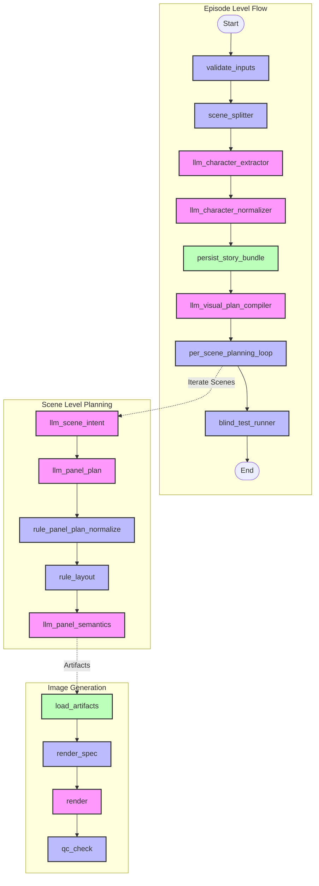

# LangGraph System Design

## Overview

This document outlines the architecture and design of the LangGraph-based system for the project. The system is designed to convert a story text into a fully realized webtoon episode through a series of autonomous agents and directed graphs.

The architecture consists of three main state graphs:

1.  **StoryBuildGraph**: Orchestrates the episode-level flow, including scene splitting, character extraction, and managing the per-scene planning loop.
2.  **ScenePlanningGraph**: Handles the detailed planning for a single scene (panel breakdown, layout, semantics).
3.  **SceneRenderGraph**: Manages the image generation process for a scene.

## System Diagram

---

## 1. StoryBuildGraph (Episode Level)

**File**: `app/graphs/story_build.py`
**State**: `StoryBuildState`

This graph is the entry point for generating a new episode. It processes the raw story text and prepares the database state.

### Nodes & Flow

1.  **`validate_inputs`**
    - **Responsibility**: Validates user inputs (max scenes, characters, styles) and initializes the progress tracking.
    - **Logic**: clamps numeric inputs to safe ranges, resolves style defaults from the DB.

2.  **`scene_splitter`**
    - **Responsibility**: Breaks the full story text into distinct scene chunks.
    - **Logic**: Uses multiple strategies with fallback:
      - Regex for explicit markers ("Scene", "Chapter").
      - Paragraph splitting.
      - Sentence splitting.
      - **Source**: `app/graphs/nodes/planning/visual_plan.py` -> `compute_scene_chunker`.

3.  **`llm_character_extractor`**
    - **Responsibility**: Identifies characters in the story.
    - **Logic**:
      - Primary: LLM (`_prompt_character_extraction`) extracts names, roles, descriptions, and evidence quotes.
      - Fallback: Heuristic NLP (Named Entity Recognition via simple regex/capitalization heuristics).
    - **Prompt**: Asks for JSON list of characters with their role (main/secondary) and relationship to the protagonist.

4.  **`llm_character_normalizer`**
    - **Responsibility**: Standardizes character data and enriches it with visual details (hair, build, outfit).
    - **Logic**:
      - Primary: LLM (`_prompt_character_normalization`) fills in missing physical attributes and creates a concise "identity line" for image prompting.
      - Fallback: Basic clean-up.
    - **Prompt**: Provides JSON schema for character verification and appearance enrichment.

5.  **`persist_story_bundle`**
    - **Responsibility**: Saves the split scenes and extracted characters to the database.
    - **Logic**: checks for existing characters to avoid duplicates, assigns canonical codes (e.g., `CHAR_A`), creates `StoryCharacter` links.

6.  **`llm_visual_plan_compiler`**
    - **Responsibility**: Creates a high-level "beat sheet" for every scene.
    - **Logic**:
      - Primary: LLM (`_prompt_visual_plan`) extracts key beats, "must_show" visual elements, and scene importance (setup, climax, cliffhanger).
      - Fallback: Heuristic summary and keyword extraction.
    - **Prompt**: Analyzes the entire scene list to ensure global consistency and flow.

7.  **`per_scene_planning` (Sub-Loop)**
    - **Responsibility**: Iterates through every scene and executes the `ScenePlanningGraph` logic (see below).
    - **Logic**: Includes episode-level guardrails (e.g., ensuring no two consecutive scenes use the same layout template logic if it causes visual monotony). Enforces "Hero Single" rule (forcing at least one high-impact single-panel scene if requested).

8.  **`blind_test_runner`**
    - **Responsibility**: Evaluates the quality of the generated plan.
    - **Logic**: Runs the `run_blind_test_evaluator` node for each scene.

---

## 2. ScenePlanningGraph (Scene Level)

**File**: `app/graphs/pipeline.py`
**State**: `PlanningState`

This graph focuses on converting a single scene's text into a structured panel plan and semantic descriptions.

### Nodes & Flow

1.  **`llm_scene_intent`**
    - **Responsibility**: Analyzes the scene's narrative purpose.
    - **Logic**: Extracts:
      - **Logline**: One-sentence summary.
      - **Pacing**: Fast/Slow/Normal.
      - **Emotional Arc**: The shifting mood.
      - **Visual Motifs**: Recurring elements.
    - **Prompt**: `_prompt_scene_intent` focuses on narrative analysis.

2.  **`llm_panel_plan`**
    - **Responsibility**: Breaks the scene into a sequence of panels.
    - **Logic**:
      - Uses **QC Rules** in the prompt (e.g., "Max closeup ratio: 0.5", "First panel MUST be establishing").
      - Generates a JSON list of panels with `panel_index`, `grammar_id` (shot type), and `utility_score`.
      - Applies heuristics to prune or weight panels based on importance.
      - **Artifact**: `panel_plan`.
    - **Prompt**: `_prompt_panel_plan` explicitly lists the grammar constraints and QC hard constraints.

3.  **`rule_panel_plan_normalize`**
    - **Responsibility**: Ensures the panel plan structure is valid.
    - **Logic**: Validates valid `grammar_id`s, ensures indices are sequential.

4.  **`rule_layout`**
    - **Responsibility**: Selects a visual layout template (SVG/Geometry).
    - **Logic**:
      - Selects a template that matches the panel count and panel weights (importance).
      - Avoids recently used templates (via exclusion list passed from parent loop).
      - Adjusts template geometry (e.g., resizing vertical panels) based on panel weights.
      - **Artifact**: `layout_template`.

5.  **`llm_panel_semantics`**
    - **Responsibility**: Generates the detailed visual description for each panel.
    - **Logic**:
      - Combines the **Scene Intent**, **Panel Plan**, and **Layout** info.
      - Uses **Genre Visual Guidelines** (e.g., specific camera angles for 'Romance' vs 'Action').
      - Generates: `description` (visuals), `characters` (who is visible), `dialogue` (what they say).
      - **Artifact**: `panel_semantics`.
    - **Prompt**: `_prompt_panel_semantics` injects character appearance blocks and genre-specific shooting guides.

6.  **`qc_checker`** (Called implicitely or explicitly in pipeline)
    - **Responsibility**: Automated Quality Control.
    - **Logic**: Checks strict rules:
      - Closeup Ratio.
      - Dialogue Density.
      - Repeated Framing (same grammar ID > 2 times).
      - Missing Environment cues on establishing shots.
    - **Artifact**: `qc_report`.

---

## 3. SceneRenderGraph (Render Level)

**File**: `app/graphs/pipeline.py`
**State**: `RenderState`

This graph handles the actual image generation.

### Nodes & Flow

1.  **`load_artifacts`**
    - **Responsibility**: Loads the finalized planning artifacts (`panel_semantics`, `layout_template`) from the DB.
    - **Logic**: Verifies that planning is complete and locked.

2.  **`render_spec`**
    - **Responsibility**: Compiles the final Stable Diffusion / Gemini Image prompt.
    - **Logic**:
      - Merges: specific panel description + global style + character identity (reference) + layout control.
      - Generates a hash (`prompt_sha256`) for deduplication.
      - **Artifact**: `render_spec`.

3.  **`render`**
    - **Responsibility**: Calls the external Image Generation API (Gemini/Vertex AI).
    - **Logic**:
      - Sends prompt + optional reference images (Character Sheets).
      - Saves the resulting image to `LocalMediaStore`.
      - **Artifact**: `render_result`.

4.  **`qc_check`**
    - **Responsibility**: Post-render QC (optional).
    - **Logic**: Can re-trigger QC logic if configured to enforce strict quality gates.

---

## Supporting Systems

### Blind Test Evaluator

**Node**: `run_blind_test_evaluator`

- **Methodology**: A "Two-Stage" LLM evaluation.
  1.  **Stage 1 (Blind Reader)**: An LLM reads _only_ the generated panel descriptions (no source text) and reconstructs the story.
  2.  **Stage 2 (Comparator)**: A second LLM compares the reconstructed story with the original source text.
- **Scoring**: Generates a similarity score (0.0 - 1.0). < 0.25 is considered a failure.

### Artifact Service

All intermediate outputs (Plans, Semantics, Reports) are stored as **Artifacts** in the database. This allows:

- Resuming the graph from any point.
- Manual overrides (Human-in-the-loop editing of artifacts).
- Audit trails.

### Reference Images

The system supports generating and using **Character Reference Images** (`face`, `full_body`) to maintain character consistency across panels. These are injected into the render prompt logic.
