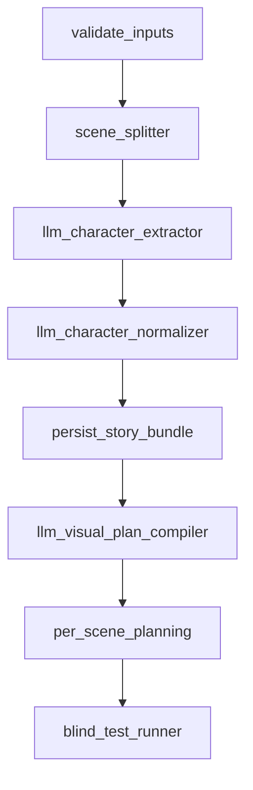
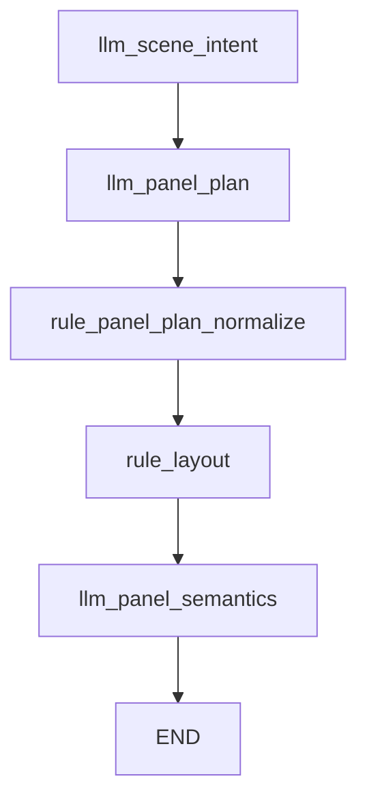
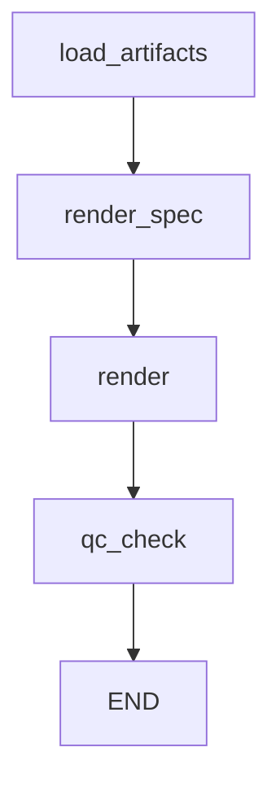

# LangGraph Architecture

## Overview

The generation pipeline is organized around three LangGraph `StateGraph`s that encapsulate the majority of planning, rendering, and evaluation work:

| Graph | Responsibility |
|-------|----------------|
| `StoryBuildGraph` | Parse a story text into characters, scenes, artifacts, and optional visual planning plus blind testing. |
| `ScenePlanningGraph` | Run the per-scene LangGraph that produces parseable panel plans, layouts, and semantics. |
| `SceneRenderGraph` | Load the latest artifacts, compile the prompt, render with Gemini, and optionally QC the result. |

Each graph emits artifacts via `ArtifactService`, updates story/scene state, and is wrapped with `trace_span` so telemetry platforms can provide timing/failure visibility.

## Graphs and Node Flow

### StoryBuildGraph

# FIFO story build planning (full mode)

- `validate_inputs`: normalizes story settings and seeds `StoryBuildState`.
- `scene_splitter`: chunks text into `Scene` candidates.
- `llm_character_*`: call into the planning nodes (`app.graphs.nodes.character`) to build profiles via Gemini.
- `persist_story_bundle`: writes scenes/characters to the DB, respects `allow_append`, assigns `CHAR_*` codes, and stores scene IDs.
- `llm_visual_plan_compiler`: produces `visual_plan` artifacts when `planning_mode == "full"` and enqueues per-scene LangGraphs.
- `per_scene_planning`: loops through scenes, re-running the scene planning nodes (panel plan → semantics → QC) and captures artifact IDs.
- `blind_test_runner`: runs the evaluation graph for each scene and records the blind-test artifacts.

Running in `characters_only` mode stops after `persist_story_bundle` (no visual plan or blind tests).

### ScenePlanningGraph

- `llm_scene_intent`: extracts pacing, logline, and importance (writes `ARTIFACT_SCENE_INTENT`).
- `llm_panel_plan`: uses heuristics + Gemini to pick a grammar-backed plan (`ARTIFACT_PANEL_PLAN`).
- `rule_panel_plan_normalize`: enforces grammar rules, prunes inset panels, reindexes.
- `rule_layout`: resolves a layout template that matches the current panel count (`ARTIFACT_LAYOUT_TEMPLATE`).
- `llm_panel_semantics`: fills descriptions, dialogue hints, and character references (`ARTIFACT_PANEL_SEMANTICS`).

This graph powers both VisualPlan loop in `StoryBuildGraph` and the standalone `/scenes/{scene_id}/plan` endpoint. Nodes use the shared prompt templates and JSON helpers in `app.graphs.nodes.prompts`.

### SceneRenderGraph

- `load_artifacts`: fetches the latest panel semantics, layout, and determines the effective style (scene overrides → story defaults).
- `render_spec`: compiles a Gemini prompt via `_compile_prompt`, storing `ARTIFACT_RENDER_SPEC`.
- `render`: invokes `GeminiClient.generate_image`, persists `ARTIFACT_RENDER_RESULT`, and attaches usage metadata.
- `qc_check`: reruns the QC node and stores `ARTIFACT_QC_REPORT`, tightening rules (e.g., closeup ratio) post-render.

`run_full_pipeline` simply invokes `ScenePlanningGraph`, runs the blind test, then executes `SceneRenderGraph` (with `enforce_qc=False` by default so render output is collected even if QC fails).

## State Schemas

| Graph | Key fields (not exhaustive) | Notes |
|-------|----------------------------|-------|
| `StoryBuildState` | `story_id`, `story_text`, `max_scenes`, `panel_count`, `allow_append`, `characters`, `scenes`, `planning_artifact_ids`, `progress`, `require_hero_single` | The TypedDict defined in `app.graphs.story_build`. Each node merges new keys into state and persists progress to `stories.progress`. |
| `PlanningState` | `scene_id`, `panel_count`, `genre`, plus artifact IDs produced by each node | Ensures the planning graph is idempotent (nodes look up latest artifacts before writing new versions). |
| `RenderState` | `scene_id`, `style_id`, `prompt_override`, `enforce_qc`, artifact IDs for semantics/layout/render spec | Render state also exposes the `GeminiClient` instance for dependency injection in tests. |
| `PipelineState` | Combines planning + render outputs plus `blind_test_report_artifact_id` | Returned by `run_full_pipeline` and mapped directly to the `/generate/full` response schema. |

Every graph passes a mutable state dict from node to node, so errors can be diagnosed via the restored state in `Story.progress` or pipeline logs.

## Artifact Lifecycle

Artifacts are created via `ArtifactService.create_artifact`, which retries on version conflicts and auto-increments `version`/`parent_id`. The key artifacts and their producing nodes:

| Artifact | Producing node(s) | Purpose |
|----------|------------------|---------|
| `scene_intent` | `run_scene_intent_extractor` | Scene-level pacing, loglines, importance hints. |
| `panel_plan` | `run_panel_plan_generator` | Raw grammar-driven panel plan prior to normalization. |
| `panel_plan_normalized` | `run_panel_plan_normalizer` | Normalized grammar array (constraints such as first panel establishing). |
| `layout_template` | `run_layout_template_resolver` | Layout metadata for render prompt. |
| `panel_semantics` | `run_panel_semantic_filler` | Detailed panel descriptions, dialogue hints, and character references. |
| `qc_report` | `run_qc_checker` | QC metrics (closeups, dialogue ratio) used by render gating. |
| `render_spec` | `run_prompt_compiler` | Fully compiled Gemini prompt + character info; renders read this payload. |
| `render_result` | `run_image_renderer` | Stores image metadata and the rendered URI for downstream downloads. |
| `blind_test_report` | `run_blind_test_evaluator` | Blind reader evaluation for quality gating. |
| `visual_plan` | `compile_visual_plan_bundle` | Scene summaries + style hints consumed by per-scene planning loops. |

Artifacts are scoped to a scene and tracked in database tables with version history so regenerations append new versions while preserving prior outputs.

## Error Handling, Retries & Observability

- `GeminiClient` (`app.services.vertex_gemini`) wraps all Gemini calls with:
  - **Circuit breakers** per operation (text/image) that open after configurable failure counts and enforce a cooldown.
  - **Retry/backoff** loops with configurable `max_retries`, `initial_backoff_seconds`, and rate-limit backoffs.
  - **Model fallbacks** (`fallback_text_model`, `fallback_image_model`) triggered when quota/content issues arise.
  - **Custom exceptions** (`GeminiRateLimitError`, `GeminiTimeoutError`, `GeminiContentFilterError`, etc.) so graphs can classify retryable vs fatal failures.
- `StoryBuildGraph` and `ScenePlanningGraph` call `_persist_progress`, which writes `story.progress` and `story.progress_updated_at` with the latest node name + message so API endpoints can surface progress or failures.
- Background work (story blueprint async + full scene renders) goes through `app.services.job_queue`, ensuring retries and cancellation without blocking FastAPI workers.
- `app/main.py` injects `Request-Context` middleware: every request gets a correlated `x-request-id`, which is also emitted in logs, Gemini payloads, and artifact metadata for downstream tracing.
- `trace_span` hooks wrap each graph call so telemetry systems (e.g., OpenTelemetry exporter) receive span names like `graph.story_build` / `graph.scene_planning`.
- Node-level QC and blind tests surface issue codes (`qc_rules` from config) so downstream dashboards can pinpoint flips (e.g., “too_many_closeups”).

## Summary

The LangGraph architecture is a layered pipeline: story processing → per-scene planning → rendering. Each graph operates on immutable typed dicts, emits clearly named artifacts, and relies on resilient Gemini plumbing plus structured logging/telemetry for observability. The new architecture doc should serve as the living reference for engineers walking through the pipeline or troubleshooting failures.
