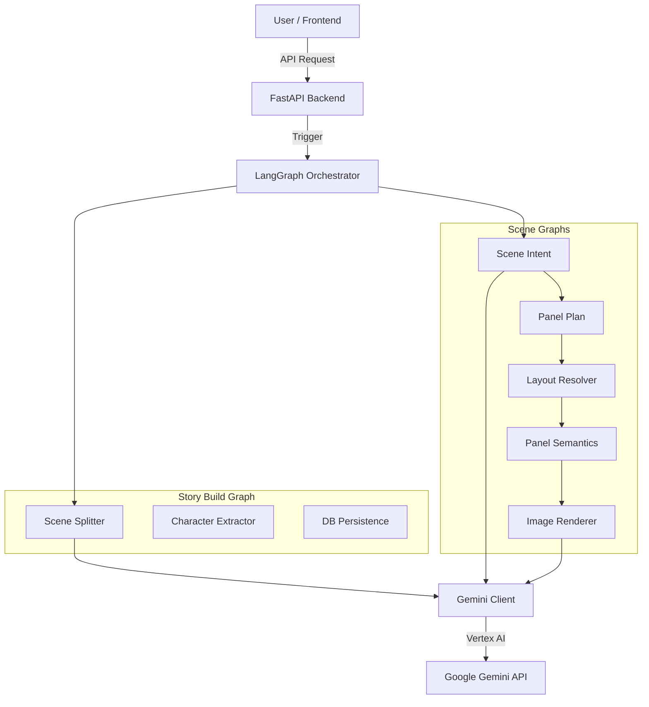

# System Architecture

## Overview

**Ssuljaengi v4** is a specialized Webtoon generation platform powered by Large Language Models (LLMs) and Generative AI. It automates the process of converting textual stories into visual webtoon scenes through a structured pipeline of planning, layout, and rendering.

The system is built on a **FastAPI** backend and leverages **LangGraph** for orchestrating complex, multi-step AI workflows. It uses **Google Gemini (Vertex AI)** as the primary intelligence engine for both text understanding and image generation.

## Core Components

### 1. Backend API (FastAPI)

- **Role**: Entry point for all user interactions.
- **Responsibilities**:
  - Managing Projects, Stories, and Scenes.
  - Triggering AI generation pipelines.
  - Serving static media assets.
  - Telemetry and Observability (OpenTelemetry).

### 2. Graph Engine (LangGraph)

The core logic resides in stateful graphs that manage the lifecycle of generation tasks.

- **Story Build Graph**: Breaks down a story into scenes and extracts characters.
- **Scene Planning Graph**: plans the panel layout, visual intent, and semantics for a single scene.
- **Scene Render Graph**: Executing the image generation based on the plan.

### 3. AI Service Layer

- **GeminiClient**: A custom wrapper around the `google-genai` SDK. it handles:
  - Text generation (Story analysis, prompting).
  - Image generation (Character and Scene rendering).
  - Safety settings and retries.

### 4. Data Layer

- **Database**: SQL Database (via SQLAlchemy) stores persistent models (Stories, Characters, Scenes).
- **Artifacts**: Intermediate JSON results (Plans, Layouts) are stored as "Artifacts" to track the lineage of generation.

## Key Workflows

### Story Generation Pipeline

1.  **Input**: User provides a story text.
2.  **Analysis**: LLM extracts characters, normalizes them, and splits the story into scenes.
3.  **Persistence**: Entities are saved to the DB for user review.

### Scene Production Pipeline

This pipeline is divided into **Planning** and **Rendering** phases to allow human-in-the-loop editing.

1.  **Planning Phase**:
    - **Intent Extraction**: detailed visual description of the scene.
    - **Panel Planning**: Determines number of panels and their content.
    - **Layout**: Selects optimal panel layout.
    - **Semantics**: Generates detailed image prompts for each panel.
2.  **Rendering Phase**:
    - **Artifact Loading**: Loads approved plans.
    - **Render Spec**: Compiles final prompts with style consistency.
    - **Generation**: Calls Gemini Image Model.
    - **QC**: Automated quality check (optional).

## Architecture Diagram (Mermaid)

## Directory Structure

- `app/api`: REST API endpoints.
- `app/graphs`: LangGraph definitions (`pipeline.py`, `story_build.py`).
- `app/graphs/nodes`: Individual processing nodes (Logic).
- `app/services`: External integrations (Gemini, Artifacts).
- `app/db`: Database models and session management.
