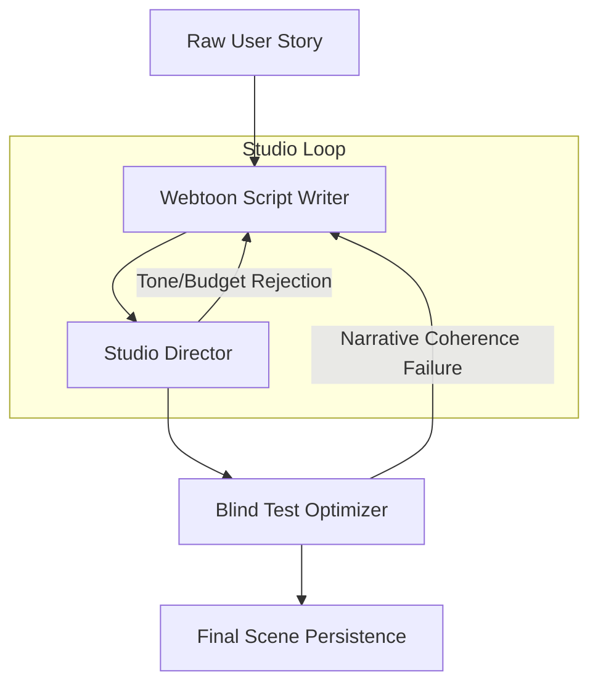

# V4 Agentic Story Architecture: Unified Studio Direction

## Overview

The V4 architecture moves away from mechanical splitting. It introduces a "Unified Studio Director" that handles both narrative pacing and visual style consistency in a single, atomic decision-making process.

## Key Components

### 1. Webtoon Script Writer (The "Lead Writer")

- **Task**: Converts prose into a visual-first script (Action, Dialogue, SFX).
- **Agentic Role**: Proposes exactly "what happens" in the story without worrying about scene counts yet.

### 2. Studio Director (The "Unified Planner")

- **Task**: Takes the script and the budget (`max_scenes`).
- **Atomic Operations**:
  - **Tone Profiling**: Identifies where the story shifts (e.g., Serious -> Chibi).
  - **Weight-Based Allocation**: Assigns "Plot Weight" to beats.
  - **Budget Optimization**: Merges low-weight beats into high-weight ones to fit `max_scenes`.
- **Output**: A sequence of scenes where each scene has a **Single Art Style** and a fixed set of narrative beats.

### 3. Blind Test Optimizer (The "Critic")

- **Task**: Validates the final allocation.
- **Agentic Role**: If it can't follow the story because the Director merged too many beats, it triggers a Re-Scripting request.

## The Power of the Unified Director

By combining Tone Planning and Budgeting:

- **Style Purity**: A scene split _never_ happens in the middle of a style shift.
- **Narrative Safety**: The system merges based on "Weight," not just word count.
- **Conflict Resolution**: If a Chibi gag is too long for the budget, the Director decides whether to keep it as a full scene or "squish" it into the background of a serious scene.

## Graph Diagram

